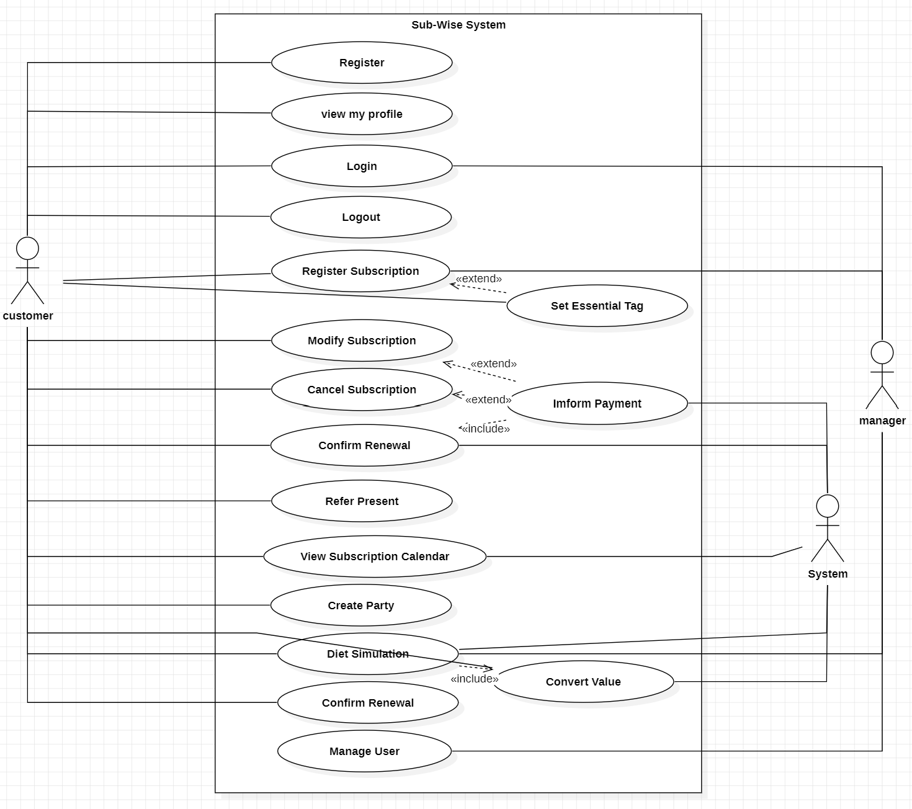
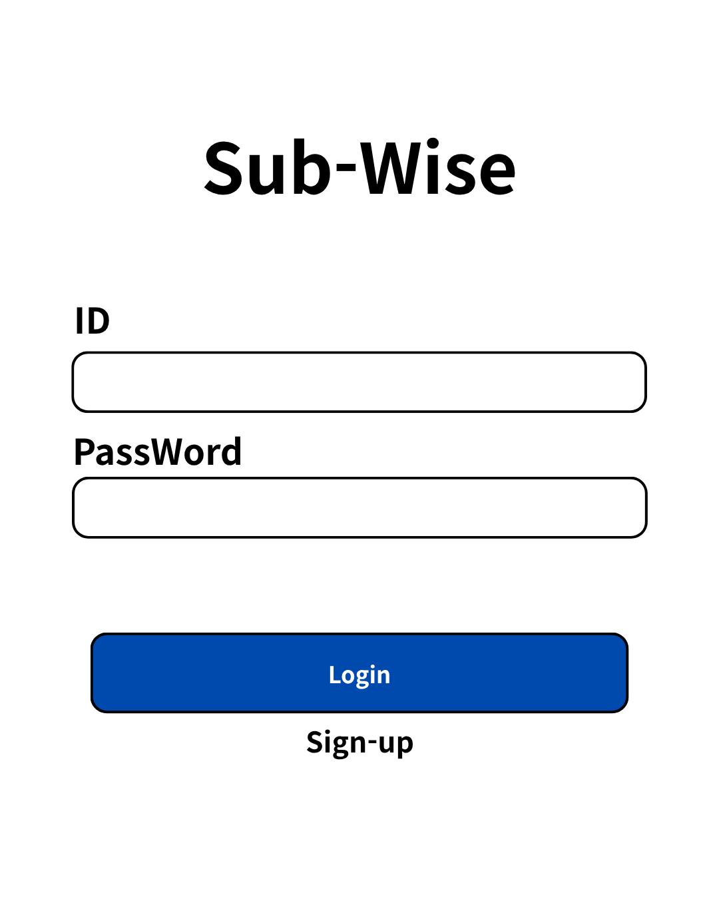
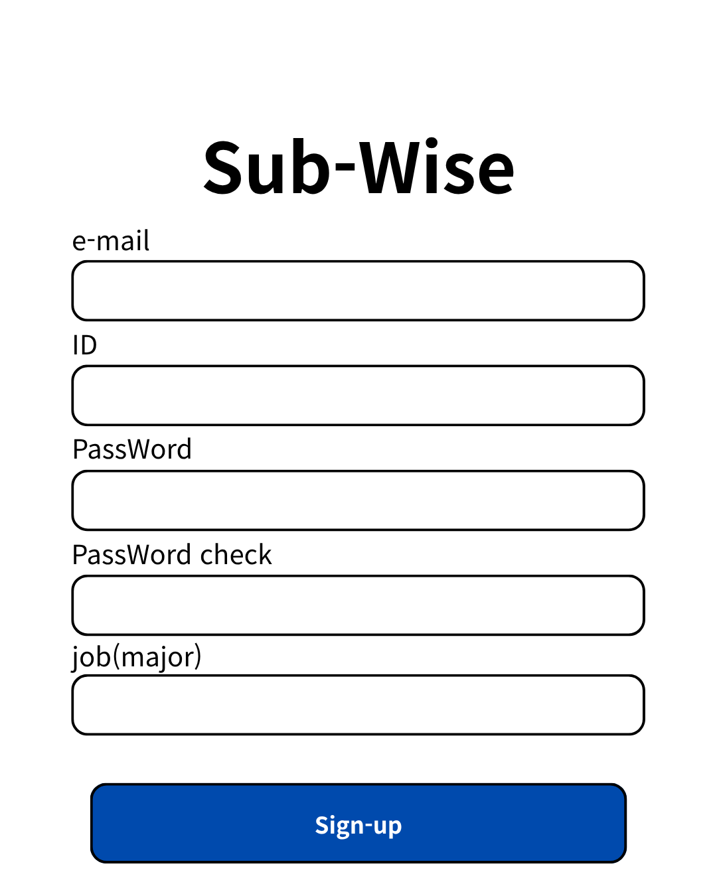
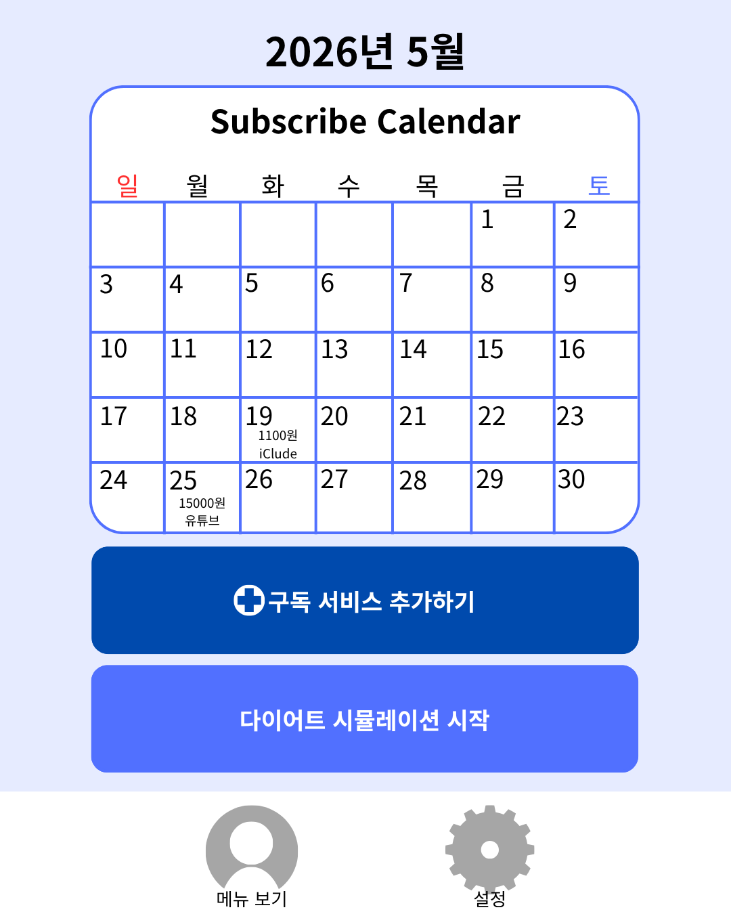
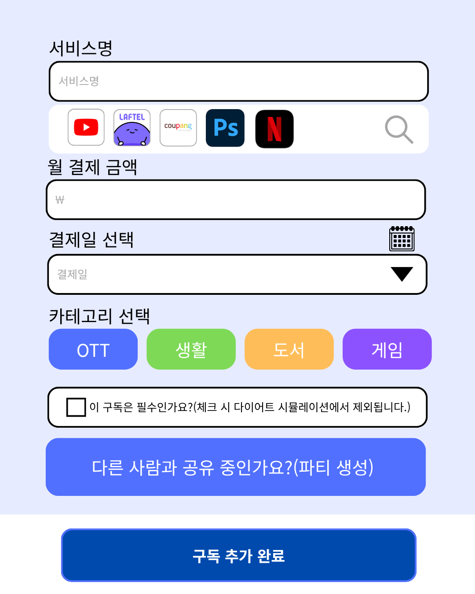
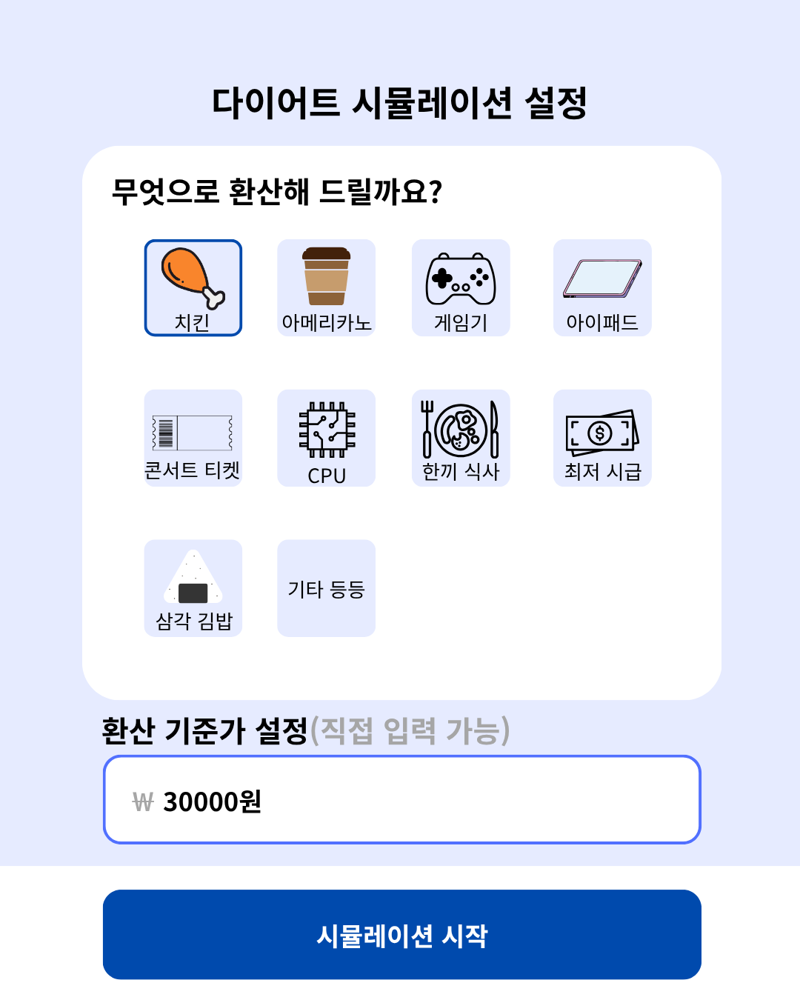
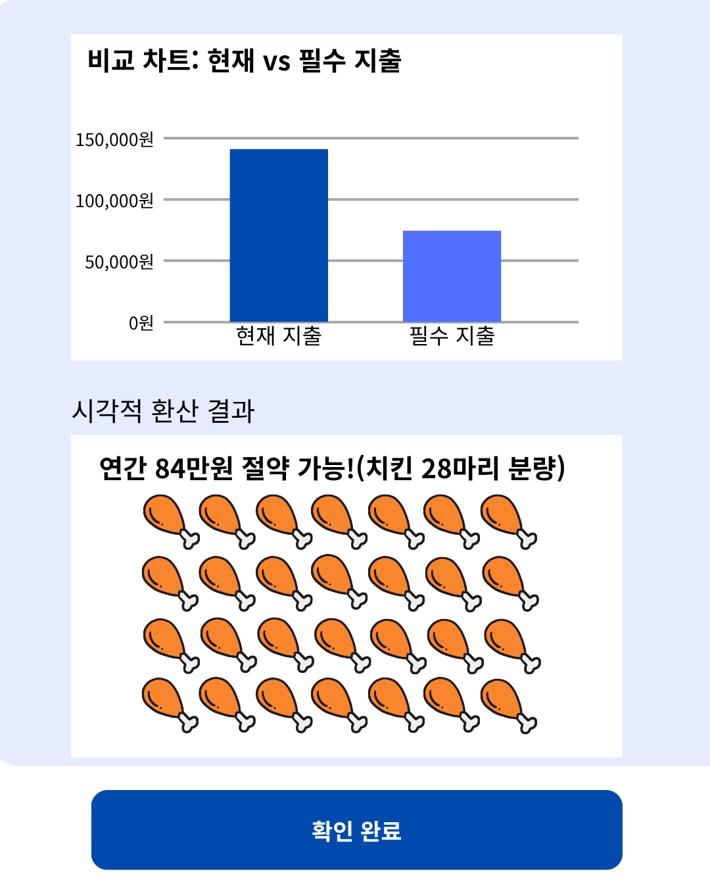

## [2. Analysis] 

# Project Title: 스마트 구독 통합 관리 및 지출 최적화 플랫폼

### 22412204 / 이채은 / E-mail: celee1440@gmail.com

### [ Revision history ]

| Revision date | Version # | Description | Author |
| :--- | :--- | :--- | :--- |
| 2026.05.08 | 1.00 | First Draft | 이채은 |

= Contents = 
1. Introduction
2. Use case analysis
3. Domain analysis
4. User Interface prototype
5. Glossary
6. References

### 1. Introduction
본 문서는 Conceptualization 단계의 문서에 이어지는 Analysis 단계의 문서이다.
#### 1.1 Summary 
최근 스마트 기기의 보급과 디지털 콘텐츠 소비의 급증으로 인해 구독 경제는 현대인의 핵심적인 소비 문화로 자리잡았다. OTT, 음원 스트리밍, 각종 멤버십 등 서비스 영역이 무한히 확장됨에 따라서 사용자는 다수의 구독 서비스를 동시에 이용하게 되었고, 이로 인해 결제 정보가 파편화가 되는 구독 피로 현상이 발생한다.

특히 서비스별로 다른 결제일, 자동결제 유도 방식으로 인해 사용자가 해지 시점을 놓쳐 불필요한 지출이 발생하는 망각의 비용이 발생하게 된다. 
이에 본 문서에서는 널려있는 구독 정보를 통합하고, 사용자의 직업적 특성에 맞춘 지출 최적화 가이드를 제공하는 프로그램을 제안한다.

시스템이 자동으로 결제일을 관리하고 지출 통계를 시각화함으로써, 사용자는 보다 합리적이고 주도적인 경제 생활을 영위할 수 있을 것으로 기대한다.

#### 1.2 Business Goals 
&middot; 사용자가 한달 지출 규모를 쉽게 알 수 있도록 구독 서비스의 세부 정보를 표시해야 한다.

&middot; 사용자의 직업 및 전공을 고려하여 구독항목을 필수/선택으로 구분하여 맞춤형 지출 가이드를 제공해야 한다.

&middot; 공유 구독 시 인원별 정산 금액을 자동으로 산출하여 정산 관리의 편의성을 제공해야한다.

&middot; 절약 가능한 비용의 실물 가치를 환산하여 보여주는 다이어트 시뮬레이션 기능을 제공해야한다.

&middot; 결제 전 알림 시스템을 통해 자동 결제에 대한 통제권을 사용자에게 제공해야 한다.

#### 1.3 Technical Goals
&middot; 구독의 상태(활성, 해지예약, 일시정지 등) 변화를 체계적으로 관리하고 데이터에 반영할 수 있어야 한다.

&middot; 사용자가 직접 입력하는 과정에서 발생할 수 있는 데이터 오류를 방지하고 정합성을 유지해야 한다.

&middot; 설정된 결제일을 기준으로 사용자에게 제때 알림을 보낼 수 있는 로직을 구축해야 한다.

&middot; 사용자의 결제 금액이나 패턴 등 민감한 정보가 안전하게 관리될 수 있도록 보안 로직을 적용해야 한다.

&middot; 지출 현황과 시뮬레이션 결과를 직관적으로 이해할 수 있는 시각적 인터페이스를 제공해야 한다.
 
 

### 2. Use case analysis

#### 2.1 Use Case Diagram

제안된 시스템은 개인 사용자, 관지자, 시스템을 대상으로 하기 때문에 Actor은 Customer, Manager, System 3명이다.
&middot; Login

&middot; Register

&middot; View my profile

&middot; Logout

&middot; Register Subscription

&middot; Modify/Cancel Subscription

&middot; Set Essential Tag

&middot; Refer Present

&middot; Inform Payment

&middot; Confirm Renewal

&middot; Create Party

&middot; Diet Simulation

&middot; Convert Value

&middot; View Subscription Calendar

&middot; Manage User
 
 

### 2.1 Use Case Description
### Use case #1 : Login
| **GENERAL CHARACTERISTICS** | |
| :--- | :--- |
| Summary | 사용자가 아이디와 비밀번호를 입력하여 시스템에 접속한다. |
| Scope | Sub-Wise |
| Level | User Level |
| Author | Customer, Manager |
| Status | Analysis |
| Primary Actor | Customer, Manager |
| Preconditions | 시스템이 실행되어 있어야 한다. |
| Success Post Condition | 권한에 맞는 메인 화면(대시보드)으로 진입한다. |
| Failed Post Condition | 로그인 실패 메시지를 출력하고 로그인 창을 유지한다. |
| **MAIN SUCCESS SCENARIO** | |
| Step | Action |
| 1 | 사용자가 아이디와 비밀번호를 입력한다. |
| 2 | 사용자가 "Login" 버튼을 클릭한다. |
| 3 | 시스템은 등록된 사용자 정보와 일치하는지 확인한다. |
| 4 | 시스템은 사용자의 권한(Customer/Manager)을 식별한다. |
| 5 | 시스템은 해당 권한에 맞는 메인 화면을 출력한다. |
| **EXTENSION SCENARIOS** | |
| Step | Branching Action |
| 3 | 3a. 아이디 또는 비밀번호가 틀린 경우   3a.1. 시스템은 로그인 정보 오류 메시지를 띄우고 다시 입력하게 한다. |
| **RELATED INFORMATION** | |
| Performance | < 1 second |
| Frequency | 사용자당 하루 평균 1~2번 |
| Concurrency | No Limits |
| Due Date | - |

---

### Use case #2 : Register
| **GENERAL CHARACTERISTICS** | |
| :--- | :--- |
| Summary | 시스템을 이용하기 위해 개인정보와 기본 계정 정보를 등록한다. |
| Scope | Sub-Wise |
| Level | User Level |
| Author | Customer |
| Status | Analysis |
| Primary Actor | Customer |
| Preconditions | 시스템이 실행되어 있어야 한다. |
| Success Post Condition | 새로운 계정이 생성되고 로그인 화면으로 이동한다. |
| Failed Post Condition | 회원가입 실패 메시지를 출력하고 입력창을 유지한다. |
| **MAIN SUCCESS SCENARIO** | |
| Step | Action |
| 1 | 사용자가 회원가입(sign-up) 메뉴를 선택한다. |
| 2 | 사용자가 이메일, 비밀번호, 닉네임, 직업(전공) 정보를 입력한다. |
| 3 | 사용자가 "가입하기" 버튼을 클릭한다. |
| 4 | 시스템은 데이터 유효성 및 중복 여부를 검사한다. |
| 5 | 시스템은 사용자 정보를 DB에 저장하고 가입 완료 메시지를 출력한다. |
| **EXTENSION SCENARIOS** | |
| Step | Branching Action |
| 4 | 4a. 이미 존재하는 이메일인 경우   4a.1. 시스템은 중복된 계정임을 알리고 다른 이메일 입력을 유도한다. |
| **RELATED INFORMATION** | |
| Performance | < 1 second |
| Frequency | 서비스 이용 시작 시 1회 |
| Concurrency | No Limits |
| Due Date | - |

---

### Use case #3 : View my profile
| **GENERAL CHARACTERISTICS** | |
| :--- | :--- |
| Summary | 사용자가 자신의 개인정보 및 설정된 직업군 정보를 확인한다. |
| Scope | Sub-Wise |
| Level | User Level |
| Author | Customer |
| Status | Analysis |
| Primary Actor | Customer |
| Preconditions | 로그인된 상태여야 한다. |
| Success Post Condition | 사용자의 프로필 상세 화면을 출력한다. |
| Failed Post Condition | 정보를 불러올 수 없음을 알린다. |
| **MAIN SUCCESS SCENARIO** | |
| Step | Action |
| 1 | 사용자가 마이페이지 또는 프로필 아이콘을 클릭한다. |
| 2 | 시스템은 DB에서 해당 사용자의 닉네임, 직업군, 총 지출액 정보를 로드한다. |
| 3 | 시스템은 프로필 화면에 해당 정보를 출력한다. |
| **EXTENSION SCENARIOS** | |
| Step | Branching Action |
| 2 | 2a. 네트워크 오류로 데이터를 불러오지 못한 경우   2a.1. 시스템은 일시적 오류 메시지를 출력한다. |
| **RELATED INFORMATION** | |
| Performance | < 1 second |
| Frequency | 사용자당 하루 평균 1~2번 |
| Concurrency | No Limits |
| Due Date | - |

---

### Use case #4 : Logout
| **GENERAL CHARACTERISTICS** | |
| :--- | :--- |
| Summary | 사용자가 시스템 이용을 종료하고 세션을 파기한다. |
| Scope | Sub-Wise |
| Level | User Level |
| Author | Customer |
| Status | Analysis |
| Primary Actor | Customer |
| Preconditions | 로그인된 상태여야 한다. |
| Success Post Condition | 세션이 삭제되고 초기 로그인 화면으로 리다이렉트된다. |
| Failed Post Condition | 로그아웃 실패 메시지를 띄운다. |
| **MAIN SUCCESS SCENARIO** | |
| Step | Action |
| 1 | 사용자가 설정 메뉴에서 로그아웃 버튼을 클릭한다. |
| 2 | 시스템은 현재 사용자의 세션 및 토큰 정보를 삭제한다. |
| 3 | 시스템은 로그인 화면으로 화면을 전환한다. |
| **EXTENSION SCENARIOS** | |
| Step | Branching Action |
| 2 | 2a. 세션 삭제 중 오류가 발생한 경우   2a.1. 시스템은 강제 로그아웃을 시도하고 초기화면으로 이동한다. |
| **RELATED INFORMATION** | |
| Performance | < 1 second |
| Frequency | 사용자당 하루 평균 1번 미만 |
| Concurrency | No Limits |
| Due Date | - |

---

### Use case #5 : Register Subscription
| **GENERAL CHARACTERISTICS** | |
| :--- | :--- |
| Summary | 이용 중인 구독 서비스의 명칭, 금액, 결제일 등의 정보를 등록한다. |
| Scope | Sub-Wise |
| Level | User Level |
| Author | Customer |
| Status | Analysis |
| Primary Actor | Customer, Manager |
| Preconditions | 로그인된 상태여야 한다. |
| Success Post Condition | 새로운 구독 항목이 데이터베이스에 저장되고 목록에 표시된다. |
| Failed Post Condition | 등록 실패 메시지를 띄우고 입력창으로 돌아간다. |
| **MAIN SUCCESS SCENARIO** | |
| Step | Action |
| 1 | 사용자가 구독 등록 버튼을 클릭한다. |
| 2 | 시스템은 서비스명, 금액, 결제일, 카테고리 입력 폼을 제공한다. |
| 3 | 사용자가 각 항목에 정보를 입력한다. |
| 4 | 사용자가 "저장" 버튼을 클릭한다. |
| 5 | 시스템은 입력된 데이터의 유효성을 검사한 후 저장한다. |
| **EXTENSION SCENARIOS** | |
| Step | Branching Action |
| 5 | 5a. 필수 입력 항목이 누락된 경우   5a.1. 시스템은 누락된 항목을 알리고 입력을 유도한다. |
| **RELATED INFORMATION** | |
| Performance | < 1 second |
| Frequency | 새로운 구독 발생 시 수시 |
| Concurrency | No Limits |
| Due Date | - |

---

### Use case #6 : Modify/Cancel Subscription
| **GENERAL CHARACTERISTICS** | |
| :--- | :--- |
| Summary | 기존 등록된 구독의 금액 수정이나 해지상태를 반영하여 데이터를 업데이트한다. |
| Scope | Sub-Wise |
| Level | User Level |
| Author | Customer |
| Status | Analysis |
| Primary Actor | Customer |
| Preconditions | 수정할 구독 항목이 존재해야 한다. |
| Success Post Condition | 변경된 구독 정보가 DB에 업데이트된다. |
| Failed Post Condition | 업데이트 실패 메시지를 출력한다. |
| **MAIN SUCCESS SCENARIO** | |
| Step | Action |
| 1 | 사용자가 구독 목록에서 수정할 항목을 선택한다. |
| 2 | 사용자가 금액을 수정하거나 "해지 완료" 상태로 변경한다. |
| 3 | 사용자가 "수정" 버튼을 클릭한다. |
| 4 | 시스템은 변경 내용을 검증하고 DB에 반영한다. |
| **EXTENSION SCENARIOS** | |
| Step | Branching Action |
| 4 | 4a. 네트워크 연결이 끊긴 경우   4a.1. 시스템은 오프라인 상태임을 알리고 나중에 다시 시도하게 한다. |
| **RELATED INFORMATION** | |
| Performance | < 1 second |
| Frequency | 구독 조건 변경 시 발생 |
| Concurrency | No Limits |
| Due Date | - |

---

### Use case #7 : Set Essential Tag
| **GENERAL CHARACTERISTICS** | |
| :--- | :--- |
| Summary | 특정 구독항목을 '필수'로 지정하여 지출감축대상에서 제외한다. |
| Scope | Sub-Wise |
| Level | User Level |
| Author | Customer |
| Status | Analysis |
| Primary Actor | Customer |
| Preconditions | 구독 등록 또는 수정 화면에 진입한 상태여야 한다. |
| Success Post Condition | 해당 항목에 필수(Essential) 플래그가 설정된다. |
| Failed Post Condition | 설정 변경을 취소한다. |
| **MAIN SUCCESS SCENARIO** | |
| Step | Action |
| 1 | 사용자가 구독 항목의 상세 설정에서 "필수 구독" 스위치를 켠다. |
| 2 | 시스템은 해당 항목을 다이어트 시뮬레이션의 계산 제외 대상으로 분류한다. |
| 3 | 시스템은 저장 시 'isEssential' 값을 True로 기록한다. |
| **EXTENSION SCENARIOS** | |
| Step | Branching Action |
| 1 | 1a. 사용자가 스위치를 다시 끄는 경우   1a.1. 시스템은 해당 항목을 다시 선택 지출 대상으로 분류한다. |
| **RELATED INFORMATION** | |
| Performance | < 1 second |
| Frequency | 구독 등록 및 관리 시 수시 |
| Concurrency | No Limits |
| Due Date | - |

---

### Use case #8 : Refer Present
| **GENERAL CHARACTERISTICS** | |
| :--- | :--- |
| Summary | 월별/카테고리별 지출 비중 및 합계를 시각적으로 확인한다. |
| Scope | Sub-Wise |
| Level | User Level |
| Author | Customer |
| Status | Analysis |
| Primary Actor | Customer |
| Preconditions | 등록된 구독 데이터가 존재해야 한다. |
| Success Post Condition | 지출 비중 차트와 리포트를 화면에 출력한다. |
| Failed Post Condition | 데이터가 부족하여 차트를 생성할 수 없음을 알린다. |
| **MAIN SUCCESS SCENARIO** | |
| Step | Action |
| 1 | 사용자가 메인 대시보드나 지출 보고서 탭을 클릭한다. |
| 2 | 시스템은 당월 구독료 데이터를 카테고리별로 집계한다. |
| 3 | 시스템은 원형 차트(Pie Chart) 및 바 그래프 형태로 지출 비중을 출력한다. |
| **EXTENSION SCENARIOS** | |
| Step | Branching Action |
| 2 | 2a. 데이터가 하나도 없는 경우   2a.1. 시스템은 "구독을 먼저 등록해 주세요"라는 안내 문구를 띄운다. |
| **RELATED INFORMATION** | |
| Performance | < 1 second |
| Frequency | 사용자당 하루 평균 3~5번 |
| Concurrency | No Limits |
| Due Date | - |

---

### Use case #9 : Inform Payment
| **GENERAL CHARACTERISTICS** | |
| :--- | :--- |
| Summary | 결제일 3일 전부터 사용자에게 푸시 알림을 통해 결제 예정임을 알린다. |
| Scope | Sub-Wise |
| Level | User Level |
| Author | Customer |
| Status | Analysis |
| Primary Actor | System |
| Preconditions | 시스템 스케줄러가 활성화되어 있어야 한다. |
| Success Post Condition | 사용자 단말기에 푸시 알림이 전송된다. |
| Failed Post Condition | 알림 전송 실패 로그를 기록한다. |
| **MAIN SUCCESS SCENARIO** | |
| Step | Action |
| 1 | 시스템 스케줄러가 매일 자정 결제 예정 데이터를 스캔한다. |
| 2 | 시스템은 결제일이 3일 남은 구독 항목을 추출한다. |
| 3 | 시스템은 푸시 서버를 통해 해당 사용자에게 알림 메시지를 전송한다. |
| **EXTENSION SCENARIOS** | |
| Step | Branching Action |
| 3 | 3a. 사용자가 알림 설정을 꺼둔 경우   3a.1. 시스템은 알림 전송을 건너뛰고 내부 로그에만 기록한다. |
| **RELATED INFORMATION** | |
| Performance | < 5 seconds |
| Frequency | 매일 자정 자동 실행 |
| Concurrency | No Limits |
| Due Date | - |

---

### Use case #10 : Confirm Renewal
| **GENERAL CHARACTERISTICS** | |
| :--- | :--- |
| Summary | 알림을 받은 후 해당 구독을 다음 달에도 유지할지 여부를 시스템에 확정한다. |
| Scope | Sub-Wise |
| Level | User Level |
| Author | Customer |
| Status | Analysis |
| Primary Actor | Customer, System |
| Preconditions | 결제 예정 알림(UC-09)이 전송된 상태여야 한다. |
| Success Post Condition | 구독 유지 상태가 업데이트되고 차기 결제 데이터가 확정된다. |
| Failed Post Condition | 응답이 없을 경우 기본값(유지)으로 처리한다. |
| **MAIN SUCCESS SCENARIO** | |
| Step | Action |
| 1 | 사용자가 전송된 알림 메시지를 클릭한다. |
| 2 | 시스템은 "구독을 유지하시겠습니까?" 팝업과 함께 해지 옵션을 보여준다. |
| 3 | 사용자가 "유지 확정" 버튼을 클릭한다. |
| 4 | 시스템은 다음 달 지출 계획에 해당 항목을 확정 반영하고 상태를 업데이트한다. |
| **EXTENSION SCENARIOS** | |
| Step | Branching Action |
| 3 | 3a. 사용자가 "해지 예약"을 선택한 경우   3a.1. 시스템은 해당 구독의 상태를 '해지 예정'으로 변경하고 다이어트 시뮬레이션에 반영한다. |
| **RELATED INFORMATION** | |
| Performance | < 1 second |
| Frequency | 결제 예정 알림 수신 시 |
| Concurrency | No Limits |
| Due Date | - |

---

### Use case #11 : Set Shared Expense (Create Party)
| **GENERAL CHARACTERISTICS** | |
| :--- | :--- |
| Summary | 공유 구독 인원을 설정하여 사용자의 실질 분담 금액을 자동으로 산출한다. |
| Scope | Sub-Wise |
| Level | User Level |
| Author | Customer |
| Status | Analysis |
| Primary Actor | Customer, System |
| Preconditions | 공유형 요금제 구독 정보(총 결제액)가 등록되어 있어야 한다. |
| Success Post Condition | 산출된 1인당 분담금이 개인 지출 통계 및 대시보드에 반영된다. |
| Failed Post Condition | 인원수 입력 오류 메시지를 출력하고 기존 총액 데이터를 유지한다. |
| **MAIN SUCCESS SCENARIO** | |
| Step | Action |
| 1 | 사용자가 특정 구독 항목의 상세 페이지에서 "공유 분담 설정" 기능을 활성화한다. |
| 2 | 사용자가 본인을 포함하여 해당 서비스를 실제 공유 중인 총 인원수(예: 4명)를 입력한다. |
| 3 | 시스템은 전체 구독료를 인원수로 나누어 사용자가 실제로 지불하는 1인분 금액을 계산한다. |
| 4 | 시스템은 계산된 금액을 '실질 지출액'으로 확정하고, 메인 대시보드와 지출 차트에 업데이트한다. |
| **EXTENSION SCENARIOS** | |
| Step | Branching Action |
| 2 | 2a. 사용자가 0명 또는 음수를 입력한 경우   2a.1. 시스템은 유효하지 않은 인원수임을 알리고 최소 1인 이상으로 재입력을 요구한다. |
| **RELATED INFORMATION** | |
| Performance | < 1 second |
| Frequency | 공유 요금제 등록/변경 시 1회 |
| Concurrency | No Limits |
| Due Date | - |

---

### Use case #12 : Diet Simulation
| **GENERAL CHARACTERISTICS** | |
| :--- | :--- |
| Summary | '필수' 항목을 제외한 선택적 구독들을 해지했을 때의 연간 절약 비용을 계산한다. |
| Scope | Sub-Wise |
| Level | User Level |
| Author | Customer |
| Status | Analysis |
| Primary Actor | Customer, Manager, System |
| Preconditions | 등록된 구독 항목이 하나 이상 존재해야 한다. |
| Success Post Condition | 연간 절약 가능한 총액이 산출되어 화면에 표시된다. |
| Failed Post Condition | 계산할 대상이 없음을 알리는 메시지를 출력한다. |
| **MAIN SUCCESS SCENARIO** | |
| Step | Action |
| 1 | 사용자가 '다이어트 시뮬레이션' 메뉴를 클릭한다. |
| 2 | 시스템은 DB에서 'Essential Tag'가 True가 아닌 항목들을 모두 필터링한다. |
| 3 | 시스템은 필터링된 항목들의 월 구독료 합계에 12를 곱하여 연간 절약액을 산출한다. |
| 4 | 시스템은 산출된 금액을 시뮬레이션 결과 창에 출력한다. |
| **EXTENSION SCENARIOS** | |
| Step | Branching Action |
| 2 | 2a. 사용자가 모든 구독을 필수(Essential)로 설정한 경우   2a.1. 시스템은 절약할 항목이 없다는 메시지를 보여주고 종료한다. |
| **RELATED INFORMATION** | |
| Performance | < 1 second |
| Frequency | 사용자당 하루 평균 1~2번 |
| Concurrency | No Limits |
| Due Date | - |

---

### Use case #13 : Convert Value
| **GENERAL CHARACTERISTICS** | |
| :--- | :--- |
| Summary | Diet Simulation에서 절약된 금액을 실물 가치(치킨, 커피 등)로 환산하여 시각화한다. |
| Scope | Sub-Wise |
| Level | User Level |
| Author | Customer |
| Status | Analysis |
| Primary Actor | Customer, System |
| Preconditions | UC-12(Diet Simulation)의 결과값이 존재해야 한다. |
| Success Post Condition | 금액에 대응하는 실물 가치 아이콘과 환산 개수가 표시된다. |
| Failed Post Condition | 가치 환산 로직 오류 시 기본 금액만 표시한다. |
| **MAIN SUCCESS SCENARIO** | |
| Step | Action |
| 1 | 시스템은 UC-12에서 계산된 연간 절약 금액 데이터를 가져온다. |
| 2 | 시스템은 미리 설정된 실물 가치 데이터베이스를 참조한다. |
| 3 | 시스템은 절약 금액을 각 아이템의 단가로 나누어 총 수량을 계산한다. |
| 4 | 시스템은 화면에 실물 가치 환산 결과를 시각적으로 출력한다. |
| **EXTENSION SCENARIOS** | |
| Step | Branching Action |
| 3 | 3a. 금액이 너무 작아 아이템 단가에 미치지 못하는 경우   3a.1. 시스템은 개수를 0으로 표시하거나 소액 절약 메시지를 보여준다. |
| **RELATED INFORMATION** | |
| Performance | < 1 second |
| Frequency | 시뮬레이션 실행 시 수반 |
| Concurrency | No Limits |
| Due Date | - |

---

### Use case #14 : View Subscription Calendar
| **GENERAL CHARACTERISTICS** | |
| :--- | :--- |
| Summary | 월별 달력 형식으로 결제 예정일과 해당 날짜의 총 지출액을 시각적으로 확인한다. |
| Scope | Sub-Wise |
| Level | User Level |
| Author | Customer |
| Status | Analysis |
| Primary Actor | Customer, System |
| Preconditions | 등록된 구독 데이터가 하나 이상 존재해야 한다. |
| Success Post Condition | 달력의 각 날짜별로 결제 정보와 합계 금액이 표시된다. |
| Failed Post Condition | 데이터를 불러올 수 없을 시 빈 달력만 출력한다. |
| **MAIN SUCCESS SCENARIO** | |
| Step | Action |
| 1 | 사용자가 하단 탭 또는 메뉴에서 '캘린더'를 선택한다. |
| 2 | 시스템은 현재 날짜 기준 해당 월의 모든 구독 결제일 데이터를 호출한다. |
| 3 | 시스템은 달력 UI의 각 날짜 칸에 해당 서비스의 로고 아이콘을 배치한다. |
| 4 | 시스템은 특정 날짜의 총 합산 금액을 출력한다. |
| **EXTENSION SCENARIOS** | |
| Step | Branching Action |
| 2 | 2a. 사용자가 이전/다음 달로 달력을 넘기는 경우   2a.1. 시스템은 해당 월의 데이터를 다시 계산하여 업데이트한다. |
| **RELATED INFORMATION** | |
| Performance | < 1 second |
| Frequency | 사용자당 하루 평균 2~3번 |
| Concurrency | No Limits |
| Due Date | - |

---

### Use case #15 : Manage User
| **GENERAL CHARACTERISTICS** | |
| :--- | :--- |
| Summary | 시스템 관리자는 등록된 고객들의 정보를 조회 및 관리할 수 있다. |
| Scope | Sub-Wise |
| Level | Manager Level |
| Author | Manager |
| Status | Analysis |
| Primary Actor | Manager |
| Preconditions | 관리자 계정으로 권한 인증이 완료된 상태여야 한다. |
| Success Post Condition | 사용자 목록 조회 및 특정 관리 액션이 수행된다. |
| Failed Post Condition | 보안 정책에 따른 접근 거부 메시지를 출력한다. |
| **MAIN SUCCESS SCENARIO** | |
| Step | Action |
| 1 | 관리자가 '사용자 관리' 대시보드에 접속한다. |
| 2 | 시스템은 등록된 전체 사용자 리스트를 화면에 출력한다. |
| 3 | 관리자가 특정 사용자를 클릭하여 상세 정보를 확인한다. |
| 4 | 시스템은 보안 정책에 따라 민감 정보를 마스킹 처리하여 보여준다. |
| 5 | 관리자가 필요 시 해당 사용자의 이용 상태를 변경한다. |
| **EXTENSION SCENARIOS** | |
| Step | Branching Action |
| 4 | 4a. 관리자가 마스킹된 민감 데이터 열람 시도 시   4a.1. 시스템은 경고 메시지와 함께 접근 로그를 남긴다. |
| **RELATED INFORMATION** | |
| Performance | < 1 second |
| Frequency | 관리자 필요 시 수시 접속 |
| Concurrency | 1 (관리자 세션) |
| Due Date | - |

### 3. Domain analysis

본 절에서는 Sub-Wise 시스템의 클래스 구조를 Server, Manager, Client 계층으로 나누어 분석하고 설명한다.

### 3.1. Server
3.1.1. SubWise_Server  
서버의 전체 자원을 관리하며, 사용자별 할당 쓰레드, 데이터베이스 연결, 클라이언트 접속 및 작업 할당을 담당하는 메인 클래스이다.

3.1.2. Service_Thread  
클라이언트와 1대1로 통신하며, 사용자의 구독 추가/수정/삭제 요청을 실시간으로 처리하는 클래스이다.

3.1.3. DB_Manager  
모든 사용자의 구독 데이터, 결제 이력, 직업군별 필수 태그 정보가 저장된 데이터베이스를 관리하고 접근하는 클래스이다.

3.1.4. Notification_Dispatcher  
결제 예정일(D-3)을 추적하여 해당 클라이언트에게 푸시 알림을 전송하는 쓰레드 클래스이다.

3.1.5. Protocol_Interface  
서버와 클라이언트 간의 원활한 데이터 통신을 위해 사전에 약속된 데이터 규약이 담긴 인터페이스이다.

---

### 3.2. Manager (System Admin)
3.2.1. Admin_Monitor  
관리자가 전체 사용자의 평균 지출 통계 및 시스템 리소스 상태를 모니터링할 수 있는 JFrame 기반의 관리자용 클래스이다.

3.2.2. Analytics_Engine  
전체 데이터를 분석하여 카테고리별 인기 구독 순위나 평균 지출 변화를 도출해내는 통계 처리 클래스이다.

3.2.3. Tag_Manager  
직업군 및 전공별로 '필수/선택' 태그의 기준값을 업데이트하고 관리하는 클래스이다.

---

### 3.3. Client (Mobile App)
3.3.1. User_Client  
클라이언트의 세션 정보와 로그인 상태를 관리하며 서버와 통신하는 메인 클래스이다.

3.3.2. DashBoard_UI  
사용자에게 월간 총 지출, 카테고리별 비중 차트, 결제 예정 목록을 보여주는 메인 JFrame 클래스이다.

3.3.3. Expense_Analyzer  
서버로부터 받은 지출 데이터를 분석하여 시각화된 차트로 변환해주는 클래스이다.

3.3.4. Diet_Simulator  
'비필수' 항목을 제외했을 때의 절약 비용을 산출하고 결과를 화면에 표시하는 클래스이다.

3.3.5. Value_Converter  
산출된 절약 금액을 치킨, 커피 등의 실물 가치 개수로 환산하여 출력해주는 클래스이다.

3.3.6. Party_Calculator  
공유 구독 서비스의 총액을 설정된 인원수(1/N)로 나누어 사용자의 실제 부담금을 계산하는 클래스이다.

3.3.7. Calendar_View  
날짜별 결제 일정을 캘린더 형식으로 출력하고 상세 정보를 보여주는 JFrame 클래스이다.

3.3.8. Receiver  
서버에서 오는 알림이나 처리 결과 데이터를 실시간으로 수신하여 UI에 반영해주는 클래스이다.

### 4. User Interface prototype

#### 4.1. Login Screen (Access Control)
[그림 4-1] Login Screen   
그림 4-1은 프로그램 실행 시 나타나는 로그인 화면이다. 사용자는 등록된 아이디와 비밀번호를 입력하여 시스템에 접속할 수 있으며, 계정이 없는 경우 회원가입 버튼을 통해 계정을 생성할 수 있다. 

#### 4.2. Register Screen (User Onboarding)

[그림4-2] Register Screen  
그림 4-2는 회원가입 화면으로 사용자의 이메일, 닉네임과 함께 직업(전공) 정보를 입력받는다. 수집된 직업 정보는 향후 다이어트 시뮬레이션의 자동 태깅 로직에서 필수 구독 항목을 분류하는 기초 데이터로 활용된다.

#### 4.3. Main Dashboard (Subscription Calendar & Navigation)
[그림 4-3] MainDashBoard  
그림 4-3은 로그인 직후 나타나는 메인 대시보드 화면이다. 화면 상단 2분의 1 영역에는 캘린더가 배치되어 일별 구독 결제 일정과 예상 지출액을 시각적으로 보여준다. 캘린더 하단에는 구독 서비스를 새로 등록할 수 있는 버튼과 지출 최적화 분석을 위한 다이어트 시뮬레이션 버튼이 위치한다. 우측 하단의 사람 모양 아이콘을 클릭하면 사용자의 프로필과 개인 설정 정보를 확인할 수 있는 메뉴로 이동한다.

#### 4.4. Subscription Registration (Add New Service)
[그림 4-4] Subscription Registration  
그림 4-4는 구독 추가 버튼을 클릭했을 때 나타나는 서비스 등록 창이다. 사용자는 서비스명, 월 결제 금액, 결제일을 입력하며 해당 서비스의 카테고리(OTT, 도서, 생활 등)를 선택할 수 있다. 중앙의 Essential 체크박스를 통해 해당 구독이 본인에게 필수적인 항목인지 설정하며, 이는 시뮬레이션 계산 시 제외 대상으로 분류된다. 하단의 다른 사람과 공유 중인가요? 버튼을 활성화하면 공유 인원수를 입력할 수 있는 슬롯이 생성되며, 시스템은 총액을 인원수로 나눈 실제 분담금을 자동으로 산출하여 저장한다.

#### 4.5. Diet Simulation Setup (Parameter Selection)
[그림 4-5]  Diet Simulation Setup  
그림 4-5는 다이어트 시뮬레이션 시작 버튼을 눌렀을 때 나타나는 설정 화면이다. 사용자는 비필수 구독 해지를 통해 절약된 금액을 어떤 실물 가치로 환산하여 볼지 선택할 수 있다. 선택지에는 치킨, 아메리카노, 아이패드, 닌텐도 게임팩 등이 포함된다. 화면 하단에는 선택한 항목의 기준가(예: 치킨 30,000원)를 직접 수정할 수 있는 입력 창이 존재하여, 실제 물가 변화에 맞춘 정확한 환산 결과를 얻을 수 있도록 설계되었다.

#### 4.6. Diet Simulation Result (Value Conversion Analysis)
 [그림 4-6] Value Conversion Result  
그림 4-6은 시뮬레이션 분석이 완료된 후 나타나는 결과 화면이다. 좌측에는 현재의 총 지출액과 필수 항목만 유지했을 때의 예상 지출액을 비교하는 바 그래프가 출력되어 절감 효과를 극명하게 보여준다. 우측에는 연간 예상 절약 총액과 함께, 이전 단계에서 선택한 실물 가치 단위로 환산된 개수가 표시된다. 예를 들어 연간 840,000원이 절약될 경우, 화면에는 치킨 아이콘 28개와 함께 시각적 결과 리포트가 출력된다.

## 5. Glossary

본 절에서는 Sub-Wise 시스템에서 사용하는 주요 용어 및 기능에 대해 정의한다.

| 용어 (Term) | 설명 (Description) |
| :--- | :--- |
| Sub-Wise | 본 프로젝트에서 개발한 구독 지출 관리 시스템의 이름이다. |
| User (사용자) | 시스템을 이용하는 고객(Customer)과 시스템을 관리하는 관리자(Manager)를 의미한다. |
| Essential Tag (필수 태그) | 구독 항목 중 사용자가 반드시 필요하다고 판단하여 해지 대상에서 제외하도록 설정한 표식이다. |
| Diet Simulation (다이어트 시뮬레이션) | 필수 태그가 붙지 않은 구독 항목들을 모두 해지했을 때, 연간 얼마나 아낄 수 있는지 계산해 주는 기능이다. |
| Value Conversion (가치 환산) | 절약한 금액을 단순히 숫자로 보여주는 것이 아니라 치킨, 커피 등 실제 물건의 개수로 바꾸어 보여주는 것을 의미한다. |
| Party (파티) | 유튜브 프리미엄이나 넷플릭스처럼 여러 명이 비용을 나누어 내는 공유 구독 형태를 의미한다. |
| Dashboard (대시보드) | 로그인 후 처음 나타나는 메인 화면으로, 캘린더와 주요 기능을 한눈에 볼 수 있는 창을 말한다. |

---

### 6. References

