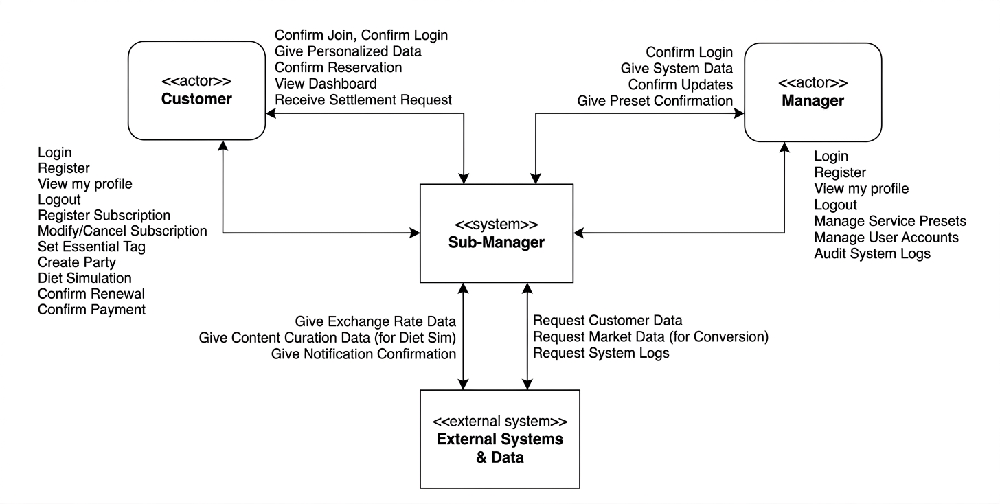

## [1. Conceptualization] 

# Project Title: 스마트 구독 통합 관리 및 지출 최적화 플랫폼

### 22412204 / 이채은 / E-mail: celee1440@gmail.com

### [ Revision history ]

| Revision date | Version # | Description | Author |
| :--- | :--- | :--- | :--- |
| 2026.03.27 | 1.00 | First Draft | 이채은 |

= Contents = 
1. Business purpose
2. System context diagram
3. Use case list
4. Concept of operation
5. Problem statement
6. Glossary
7. References

### 1. Business purpose 
#### 1) Project background 
4차 산업혁명과 정보통신기술의 비약적인 발전은 현대 비즈니스 환경에 패러타임 변화를 가져왔다. 그 중심에는 소유보다 경험과 효율을 중시하는 MZ세대가 있었고, 이들의 소비 패러다임 변화를 이끌었다. 과거 고가의 제품을 영구 소유하던 방식은 글로벌 금융위기 이후 경기 불황과 소득 정체를 거치며 경제적 부담으로 다가왔고, 이는 합리적 비용으로 필요한 만큼만 이용하는 '구독경제'의 확산으로 이어졌다. 특히 스마트폰 기반의 N스크린 환경은 시공간의 제약 없는 서비스 이용을 가능케하여 구독 서비스를 MZ세대의 핵심 소비 트렌드로 정착시켰다.

특히 최근 구독경제는 과거의 신문이나 우유 배달같은 단순한 형태를넘어 OTT, 음원, 게임은 물론 식음료, 의류, 안경, 세제같은 생필품 영역까지 깊숙히 침투하며 우리 삶에 완전히 고착화되었다. 하지만 이러한 구독 서비스의 폭발적인 증가는 역설적으로 소비자에게 새로운 형태의 관리적 고통인 '구독 피로'를 안겨주었다. 
    
서비스마다 결제일과 결제 수단이 제각각으로 분산되어 있어 정보의 파편화가 발생하며, 이로 인해 사용자는 자신이 한 달에 정확히 얼마를 지출하고 있는지 전체적인 규모를 파악하기가 매우 어려워졌다. 
바쁜일상 속에서 사용하지않는 서비스를 해지하는 것을 잊어버려 발생하는 '망각의 비용'은 고스란히 소비자의 경제적 손실로 이어지고 있으며, 이는 기업에게는 반복적 수익을 주지만 소비자에게는 통제할 수 있는 고정 지출의 늪이 되고있다.

또한, 사용자의 직업이나 전공에 따라 반드시 유지해야하는 '필수 도구'와 해지해도 무방한 '취미성 서비스'를 구분하여 지출 최적화를 하도록 돕게한다. 본 프로젝트에서 개발하고자 하는 Sub-Manager는 바로 이러한 구독 관리의 파편화와 불투명성이라는 문제를 객체지향적 설계를 통해 채계적으로 해결하고자 한다.
사용자가 자신의 직업적 틍선에 맞춰 항목을 '필수'와 '선택'으로 분류할 수 있게 함으로써 맞춤형 지출 가이드를 제공하며, 결제 전 알림 시스템을 통해 자통 결제에 대한 통제권을 되찾게한다. 
    특히 공유 문화를 반영한 정산 관리 기능관, 절역한 비용을 실물 가치로 환산해 보여주는 '다이어트 시뮬레이션' 기능을 통해 사용자가 지출 절감을 하나의 재미있는 경험으로 인식하게 함으로써, 결과적으로 구독 경제 시대에 사용자가 보다 주도적이고 합리적인 소비생활을 할 수 있게한다.

#### 2) Motivation 
- 망각의 비용 발생: 기업의 자동 결제 유도로 인해 해지 시점을 놓쳐 발생하는 불필요한 지출을 방지하고자 한다.
 - 통제권 회복: 한 달에 얼마를 쓰는지 명확히 보여줌으로써 사용자의 심리적 안정감을 제고하게한다.

#### 3) Goal 
- 경제적 가치: 
    - 지출 가시성 확보: 파편화된 구독 정보를 캘린더에 정리하여 지출을 한눈에 파악하게 함.
    - 매몰 비용 최소화: 사용자의 직업적 특성을 반영하여 필수/선택 분류 체계를 통해 망각의 비용을 차단하고 실질적인 가계 가용 소득을 증대시킴.
    - 행동 경제학적 동기 매커니즘: 단순 지출합계를 넘어서, 절감 가능한 비용을 실물 가치 지표로 환산하여 사용자에게 합리적 소비 결정을 유도하게한다.

- 사용자 경험 가치
    - 구독 피로 완화: 결제 전 알림 및 갱신 확정 루틴을 통해 서비스 유지 여부에 대해 능동적으로 통제한다.

#### 4) Target market 
- 다수의 OTT 및 멤버십을 이용하는 20,30대.
- 업무용(필수)과 취미용(선택) 구독이 혼재된 프리랜서 및 대학생.

### 2. System context diagram 

- Login
- Register
- View my profile
- Logout
- Register Subscription 
- Modify/Cancel Subscription
- Set Essential Tag
- Refer Present
- Inform Payment
- Confirm Renewal
- Create Party
- Request Settlement
- Confirm Payment
- Diet Simulation
- Convert Value

### 3. Use case list 
#### 1) Login

| Actor | Customer, Manager |
| :--- | :--- |
| Description  | 등록된 아이디와 비밀번호를 통해 시스템에 접속한다. 각자의 권한에 맞는 UI가 제공된다. |

#### 2) Register

| Actor | Customer |
| :--- | :--- |
| Description  | 시스템을 이용하기 위해 개인정보와 기본 계정 정보를 등록한다. |

#### 3) View my profile

| Actor | Customer |
| :--- | :--- |
| Description  | 사용자가 자신의 정보를 확인한다. |

#### 4) Logout

| Actor | Customer |
| :--- | :--- |
| Description  | 사용자가 자신의 정보를 확인한다 |

#### 5) Register Subscription 

| Actor | Customer, Manager |
| :--- | :--- |
| Description  | 이용 중인 구독 서비스의 명칭, 금액, 결제일을 시스템에 등록한다. |

#### 6) Modify/Cancel Subscription

| Actor | Customer |
| :--- | :--- |
| Description  | 기존 등록된 구독의 금액 수정이나 해지상태를 반영하여 데이터를 업데이트한다. |

#### 7) Set Essential Tag

| Actor | Customer |
| :--- | :--- |
| Description  | 특정 구독항목을 '필수'로 지정하여 지출감축대상에서 제외한다. |

#### 8) Refer Present

| Actor | Customer |
| :--- | :--- |
| Description  | 월별/카테고리별 지출 비중 및 합계를 시각적으로 확인한다. |

#### 9) Inform Payment

| Actor | System |
| :--- | :--- |
| Description  | 결제일 3일전부터 사용자에게 푸시 알림을 통해 결제 예정 알림을 보낸다. |

#### 10) Confirm Renewal

| Actor | Customer, System |
| :--- | :--- |
| Description  | 알림을 받은 후에도 해당 구독을 다음달에도 유지할지 여부를 시스템에 확정한다. |

#### 11) Create Party

| Actor | Customer, System |
| :--- | :--- |
| Description  | 공유 구독 인원을 설정하고, 인당 분담 금액을 자동으로 산출한다 |

#### 12) Diet Simulation

| Actor | Customer, Manager, System |
| :--- | :--- |
| Description  | 필수 항목을 제외한 선택적 구독들을 해지했을 때의 연간 절약 비용을 계산한다. |

#### 13) Convert Value

| Actor | Customer, System |
| :--- | :--- |
| Description  | Diet Simulation에서 절약된 금액을 치킨, 커피, 전자기기 등 실물 가치로 환산하여 시각화 한다. |

#### 14) View Subscription Calendar

| Actor | Customer, System |
| :--- | :--- |
| Description  | 월별 달력 형식으로 결제 예정일과 해당 날짜의 총 지출액을 시각적으로 확인한다. |

#### 15) Manage User

| Actor | Manager |
| :--- | :--- |
| Description  | 시스템 관리자는 등록된 고객들의 정보를 조회 및 관리할 수 있다. 단, 보안 및 개인정보 보호 원칙에 따라 비밀번호, 결제 수단 상세 정보 등 민감 데이터에는 접근이 불가능하도록 제한한다. |

### 4. Concept of operation 
#### 1) Login
| Purpose | 개인별 구독 데이터 보안 유지 및 사용자별 권한(Customer/Manager) 분리. |
| --- | --- |
| Approach | ID/PW 기반 인증을 거쳐 세션을 생성하며, 관리자 계정일 경우 별도의 통계 및 프리셋 관리 메뉴를 활성화함. |
| Dynamics | 앱 실행 후 초기 진입 단계에서 인증 정보를 입력할 때. |
| Goals | 인가된 사용자만 데이터에 접근하게 하여 개인정보 무결성 확보. |

#### 2) Register
| Purpose | 시스템 이용을 위한 신규 사용자 식별 정보 수집. |
| --- | --- |
| Approach | 이메일, 비밀번호 등 기본 정보와 함께 초기 페르소나 설정을 위한 기초 데이터를 수집함. |
| Dynamics | 서비스 미가입자가 최초로 계정을 생성하고자 할 때. |
| Goals | 고유 사용자 식별자(UID) 생성을 통한 개인화 서비스 토대 마련. |

#### 3) View my profile
| Purpose | 사용자 정보 확인 및 직업군 기반의 추천 로직 설정 관리. |
| --- | --- |
| Approach | DB에 저장된 사용자의 프로필 사진, 닉네임, 설정된 직업(디자이너, 학생 등) 정보를 로드하여 화면에 출력함. |
| Dynamics | 사용자가 마이페이지 메뉴에 진입할 때. |
| Goals | 자신의 설정 상태를 확인하고 시스템의 개인화 정확도를 높임. |

#### 4) Logout
| Purpose | 사용 종료 시 세션을 파기하여 계정 도용 방지. |
| --- | --- |
| Approach | 서버와 클라이언트에 저장된 토큰 및 세션 정보를 즉시 삭제하고 초기 로그인 화면으로 리다이렉트함. |
| Dynamics | 사용자가 설정 메뉴에서 로그아웃 버튼을 클릭할 때. |
| Goals | 공용 단말기나 타 기기에서의 정보 유출 방지 및 보안 강화. |

#### 5) Register Subscription
| Purpose | 관리 대상이 되는 구독 서비스의 기초 데이터 생성. |
| --- | --- |
| Approach | 서비스 명칭, 월 결제액, 결제 예정일 등을 입력받아 사용자별 구독 테이블(Database)에 신규 레코드를 추가함. |
| Dynamics | 사용자가 새로운 구독 서비스를 시작하여 앱에 등록하고자 할 때. |
| Goals | 누락 없는 구독 자산 목록화 및 지출 분석의 기초 데이터 확보. |

#### 6) Modify/Cancel Subscription
| Purpose | 실제 구독 상태 변화를 시스템 데이터에 동기화. |
| --- | --- |
| Approach | 요금제 변경 시 금액을 수정하거나, 해지 시 상태값을 'Active'에서 'Expired'로 업데이트하여 통계에서 제외함. |
| Dynamics | 사용자가 서비스 요금제를 변경하거나 해지 예약을 확정했을 때. |
| Goals | 실지출액과 시스템상 지출액 간의 오차(Data Discrepancy) 제거. |

#### 7) Set Essential Tag
| Purpose | 주관적인 가치 기준에 따른 지출 우선순위 설정. |
| --- | --- |
| Approach | 각 구독 항목에 '필수(Essential)' 플래그를 설정하여, 다이어트 시뮬레이션 시 삭제 후보군에서 제외되도록 로직을 격리함. |
| Dynamics | 구독 등록 시 혹은 목록 편집 화면에서 필수 여부 스위치를 조작할 때. |
| Goals | 개인별 맞춤형 지출 가이드라인 구축 및 합리적 해지 제안의 타당성 확보. |

#### 8) Refer Present
| Purpose | 전체 구독 지출 규모 및 카테고리별 비중의 시각적 파악. |
| --- | --- |
| Approach | 당월 결제 예정 데이터를 집계(Aggregation)하여 원형 차트나 바 그래프 형태로 가공하여 대시보드에 노출함. |
| Dynamics | 사용자가 앱 메인 화면이나 지출 보고서 탭을 클릭할 때. |
| Goals | 텍스트 위주의 지출 정보를 시각화하여 사용자의 인지적 부하 감소. |

#### 9) Inform Payment
| Purpose | 자동 결제 전 사용자의 인지 및 대비 시간 확보. |
| --- | --- |
| Approach | 시스템 스케줄러가 매일 자정 결제 D-3일 데이터를 스캔하여 외부 푸시 서버를 통해 알림을 전송함. |
| Dynamics | 특정 구독 서비스의 결제 예정일이 다가올 때 시스템이 자동으로 실행. |
| Goals | '망각의 비용' 발생을 원천 차단하고 결제 전 해지 기회 제공. |

#### 10) Confirm Renewal
| Purpose | 다음 결제 주기에 대한 사용자의 명확한 의사결정 수립. |
| --- | --- |
| Approach | 알림을 받은 사용자로부터 '유지' 또는 '해지' 응답을 받아, 다음 달 지출 계획에 즉시 반영함. |
| Dynamics | 결제 알림 팝업 내에서 사용자가 확인 버튼을 누를 때. |
| Goals | 수동적 자동 결제 구조를 능동적 선택 구조로 전환. |

#### 11) Create Party
| Purpose | 공유 구독 인원 간의 복잡한 비용 분담 계산 자동화. |
| --- | --- |
| Approach | 총액과 인원수를 입력받아 1인당 분담금을 산출하고, 계좌 정보가 포함된 정산 양식을 생성함. |
| Dynamics | 넷플릭스 등 프리미엄 요금제를 지인과 공유하기 위해 파티를 구성할 때. |
| Goals | 정확한 비용 분할 로직을 통한 금전적 신뢰성 확보. |

#### 12) Diet Simulation
| Purpose | 선택적 지출 제거 시의 경제적 이득 수치화. |
| --- | --- |
| Approach | '필수' 태그가 없는 모든 구독료를 합산하여 연간 총액을 계산하고, 현재 지출 대비 절감액을 시뮬레이션함. |
| Dynamics | 사용자가 '구독 다이어트' 메뉴에서 최적화 실행 버튼을 누를 때. |
| Goals | 막연한 절약 의지를 구체적인 데이터 수치로 전환하여 동기 부여. |

#### 13) Convert Value
| Purpose | 화폐 단위를 실물 가치로 치환하여 체감도 증대. |
| --- | --- |
| Approach | 시뮬레이션된 절감액을 미리 정의된 실물 데이터(치킨, 아이패드 등)의 가격과 매칭하여 결과값을 출력함. |
| Dynamics | 다이어트 시뮬레이션 결과가 도출된 직후 화면에 시각화됨. |
| Goals | 합리적 소비의 효용을 일상적인 가치로 전달하여 재미 요소 추가. |

#### 14) View Subscription Calendar
| Purpose | 일별 지출 흐름의 시계열적 파악 및 예산 관리. |
| --- | --- |
| Approach | 달력 위젯에 결제일 데이터를 매핑하여 특정 날짜에 결제될 총액과 서비스 아이콘을 배치함. |
| Dynamics | 사용자가 하단 메뉴에서 캘린더 아이콘을 클릭할 때. |
| Goals | 특정 시기에 집중된 지출을 사전 인지하여 잔액 부족 등 예외 상황 방지. |

#### 15) Manage User
| Purpose | 시스템 운영 효율성 제고 및 사용자 데이터 보안 유지. |
| --- | --- |
| Approach | 관리자 페이지를 통해 전체 사용자 리스트를 모니터링하되, 데이터 마스킹(Masking) 및 접근 제어 로직을 적용하여 민감 정보 유출을 원천 차단함. |
| Dynamics | 시스템 운영자가 사용자 현황 점검이나 계정 상태 변경(활성/정지)이 필요할 때. |
| Goals | 개인정보 보호법을 준수하면서도 안정적인 서비스 운영 환경을 구축함. |
    
    
    
    

### 5. Problem statement 
- Overview

Sub-Manager는 파편화된 구독 지출의 가시성을 확보하고 알림을 통해 '망각의 비용'을 최소화하는 서비스다. 목표 달성을 위한 핵심 기술적 과제는 다음과 같다.

#### 1) Problem #1:  Data Synchronization & Persistence

빈번한 데이터 호출로 인한 네트워크 낭비를 방지하기 위해 로컬 DB 캐싱과 서버 동기화를 결합한 하이브리드 데이터 구성이 필요하다.

    - 해결: 사용 데이터와 시스템 프리셋을 분리 관리하여 동기화 효율을 최적화함.

#### 2) Problem #2: Standardizing Subscription Policy

다양한 서비스의 요금제 및 환불 정책을 수동으로 관리하는 데 한계가 있어 이를 표준화된 데이터 모델로 구축해야 한다.

    - 해결: 공통 속성을 정의한 표준 스키마를 설계하여 관리 효율성을 제고함.

#### 3) Problem #3: Platform & Notification Reliability

다양한 모바일 환경에서 데이터 일관성을 유지하고, 결제 알림이 OS 백그라운드 정책에 상관없이 안정적으로 전달되어야 한다.

    - 해결: 외부 푸시 서버(FCM 등) 연동을 통한 알림 신뢰성 확보 및 API 기반 설계 지향.

#### 4) Problem #4: Learning Curve of Development API

본 서비스 구현에 필요한 외부 결제 연동 및 데이터 분석 API 활용 경험이 부족하여, 초기 기능 구현 시 기술적 불확실성과 학습 비용이 발생할 수 있는 리스크가 존재한다.

    - 해결: 공식 문서 기반의 단계적 프로토타이핑을 통해 기술 숙련도를 확보하고, 핵심 로직부터 우선 구현하여 개발 지연을 방지한다.
            
### 6. Glossary 
- 구독 경제: 제품을 소유하는 대신 일정 기간 비용을 지불하고 서비스 이용권한을 부여받는 경제 모델. 
- 구독 피로: 너무 많은 유료 서비스 이용으로 인해 발생하는 관리적/경제적 스트레스. 
- 망각의 비용: 서비스 해지 시점을 놓쳐 의도치 않게 자동 결제됨으로써 발생하는 매몰 비용

- 필수 구독: 사용자의 직업, 전공, 생계와 직결되어 지출 절감 대상에서 제외되는 서비스군(예: 포토샵 등)
- 선택적 구독: 개인의 취미나 엔터테인먼트를 목적으로 하며, 지출 최적화 시 우선적으로 해지 제안 대상이 되는 서비스군
- 기회 비용: 어떤 선택으로 인해 포기한 다른 선택지 중 최선의 가치. 
- 다이어트 시뮬레이션: 선택적 구독 항목을 가상으로 제거했을 떄의 연간 절약 비용을 계산하고 이를 시각화하여 합리적 의사결정을 돕는 기능
- N스크린: 하나의 콘텐츠를 스마트폰, 태블릿, PC 등 다양한 디지털 기기에서 끊김없이 이용할 수 있는 기술적 환경. 구독 서비스 확산의 주요 배경
- 프리셋: 주요 구독 서비스의 요금제 및 로고 정보를 시스템에 미리 등록해둔 데이터 템플릿
    
### 7. References
- 김병운. "온·오프라인 구독서비스 이용과 선택이 지속이용에 미치는 영향에 관한 연구." 국내박사학위논문 대전대학교 일반대학원, 2022. 대전