## [3. Design]

# Project Title: 스마트 구독 통합 관리 및 지출 최적화 플랫폼

### 22412204 / 이채은 / E-mail: celee1440@gmail.com
### 현재 git repository 주소 : https://github.com/LeeChaeEun129/OSS-Design

| Revision date | Version # | Description | Author |
| :--- | :--- | :--- | :--- |
| 2026.06.04 | 1.00 | First Draft | 이채은 |

= Contents = 
1. Introduction
2. Class diagram
3. Sequence diagram
4. State machine diagram
5. Implementation requirements
6. Glossary
7. References

## 1. Introduction
### 1.1 Summary
우리는 일상생활 속에서 영상 스트리밍, 음원, 도서, 각종 멤버십 등 다양한 구독 서비스를 이용한다. 
하지만 종종 매달 여러 플랫폼에서 각각 결제되는 구독료의 총액이나 정확한 결제일을 파악하지 못해 곤란을 겪는 경우가 있다. 
일반적으로 개별 구독 서비스의 결제 내역과 자동 결제일 관리는 해당 서비스사 플랫폼 내부의 전유영역이다. 

그렇기 때문에 사용자들은 본인이 이용 중인 서비스들의 결제일이 언제인지, 이번 달 고정 지출 총합이 얼마인지를 각 앱에 일일이 접속하여 확인하지 않는 한 명확히 알지 못한다. 

하지만 정확한 구독 지출 사항은 주도적인 자산 관리를 하는 소비자에게 반드시 필요한 정보이다. 결제 시점을 인지하지 못해 해지 타이밍을 놓치거나, 불필요한 구독이 유지되어 망각의 비용을 지불한 경우가 종종 있을 것이다. 

위의 불편함을 해결하기 위해 산재한 구독 정보를 통합 캘린더로 가시화하고, 비필수 구독 해지 시 절약되는 비용을 실물 가치로 환산하여 보여주는 시스템 Sub-Wise를 고안했다. 

이를 통해서 소비자들이 직접 계산하지 않아도 인원별 공유 분담금과 연간 절약액을 알 수 있을 것이며, 다양한 구독 서비스에 가입되어 있어도 한 시스템에서 정보를 직관적으로 통합 관리할 수 있을 것이다.

이 문서는 Sub-Wise를 개발하기 위한 세 번째 단계인 Design에 대한 내용으로, 실제 구현에 대한 세부적인 사항을 명시하고, Diagram들을 통해 시스템의 전반적인 모습을 시각화, 순서화하여 보여준다.

### 1.2 Important Points of Design
&middot; Class 간의 정보 공유 및 데이터 통신을 수행하되, 사용자의 계정 정보 및 민감한 고정 지출 데이터가 외부로 노출되지 않도록 은닉성을 보장해야 한다.

## 2. Class diagram

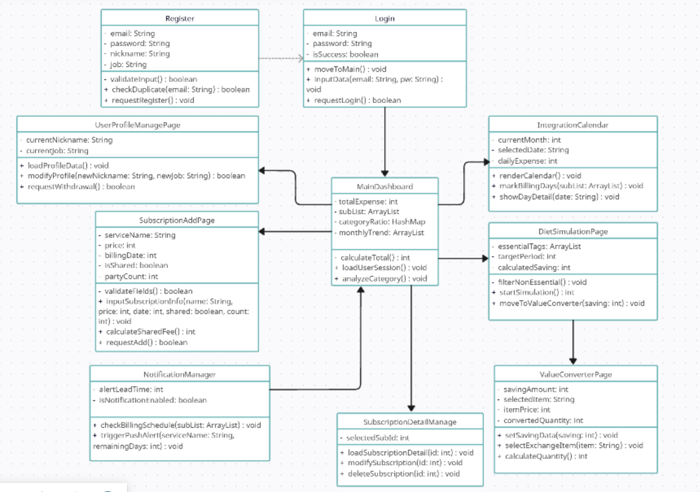

### 1) Login
| 구분 | 이름 및 타입 | 설명 |
| :--- | :--- | :--- |
| Attributes | - email: String | 로그인을 위해 사용자가 입력한 이메일 ID |
| | - password: String | 로그인을 위해 사용자가 입력한 비밀번호 |
| | - isSuccess: boolean | 서버로부터 인증된 로그인 성공 여부 |
| Methods | + inputData(email: String, pw: String) : void | 사용자가 입력한 계정 데이터를 수집함 |
| | + requestLogin() : boolean | 서버에 로그인 패킷을 송신하고 인증 결과를 반환받음 |
| | + moveToMain() : void | 로그인 성공 시 메인 대시보드 화면으로 전환함 |

#### Description : 
Login 클래스는 사용자가 앱을 실행했을 때 가장 먼저 접하는 화면과 인증 기능을 담당한다. 사용자의 아이디와 비밀번호 입력을 처리하고 서버 통신을 통해 회원 인증 세션을 확보하는 역할을 수행한다.

---

### 2) Register
| 구분 | 이름 및 타입 | 설명 |
| :--- | :--- | :--- |
| Attributes | - email: String | 가입하고자 하는 사용자의 이메일 주소 |
| | - password: String | 계정 보호를 위해 설정한 비밀번호 |
| | - nickname: String | 앱 내에서 표시될 사용자의 닉네임 |
| | - job: String | 맞춤형 지출 가이드라인의 기준이 되는 사용자의 직업 또는 전공 |
| Methods | + checkDuplicate(email: String) : boolean | 입력한 이메일이 이미 존재하는지 중복 여부를 확인함 |
| | - validateInput() : boolean | 이메일 형식 및 비밀번호 글자 수의 유효성을 내부적으로 검증함 |
| | + requestRegister() : void | 모든 조건이 충족되면 데이터베이스 서버에 회원 등록을 요청함 |

#### Description : 
Register 클래스는 새로운 사용자가 시스템에 진입하기 위한 회원가입 화면과 로직을 담당한다. 가입 시 사용자의 기본 프로필과 함께 직업군 데이터를 확보하여 향후 지출 분석의 기초 자료로 활용한다.

---

### 3) MainDashboard
| 구분 | 이름 및 타입 | 설명 |
| :--- | :--- | :--- |
| Attributes | - totalExpense: int | 당월 사용자가 이용 중인 전체 구독 서비스의 합산 지출 금액 |
| | - subList: ArrayList | 사용자가 현재 등록하여 유지하고 있는 구독 서비스 객체들의 리스트 |
| | - categoryRatio: HashMap | 카테고리별 지출 비중 데이터 |
| | - monthlyTrend: ArrayList | 최근 수개월간의 월별 총 지출 변화 추이 배열 |
| Methods | + loadUserSession() : void | 현재 로그인한 유저의 구독 리스트와 지출 데이터를 동적으로 불러옴 |
| | - calculateTotal() : int | 등록된 구독 서비스들의 금액을 연산하여 총합을 내부적으로 산출함 |
| | + analyzeCategory() : void | 사용자의 구독 데이터를 분석하여 통계 차트 데이터를 생성함 |

#### Description : 
MainDashboard 클래스는 로그인 성공 후 진입하는 앱의 통합 메인 홈 화면 인터페이스를 제어한다. 사용자의 전체 구독 현황, 당월 고정 지출 총액, 카테고리별 소비 패턴 그래프를 한눈에 볼 수 있도록 지원한다.

---

### 4) UserProfileManagePage
| 구분 | 이름 및 타입 | 설명 |
| :--- | :--- | :--- |
| Attributes | - currentNickname: String | 현재 로그인된 유저의 기존 닉네임 |
| | - currentJob: String | 현재 설정되어 있는 유저의 직업 또는 전공 정보 |
| Methods | + loadProfileData() : void | 사용자의 기존 프로필 정보를 화면에 호출함 |
| | + modifyProfile(newNickname: String, newJob: String) : boolean | 변경된 닉네임이나 새로운 직업군 정보를 입력받아 시스템 데이터베이스에 업데이트함 |
| | + requestWithdrawal() : boolean | 사용자가 서비스를 탈퇴하고자 할 때 계정 및 연동 데이터를 영구 삭제 요청함 |

#### Description : 
UserProfileManagePage 클래스는 사용자의 프로필 편집 및 계정 관리를 전담하는 독립 화면 클래스이다. 특히 사용자의 직업이 변경되었을 때 이를 업데이트함으로써, 다이어트 시뮬레이션 시 적용되는 필수 태그 기준값이 동적으로 재설정되도록 지원한다.

---

### 5) SubscriptionAddPage
| 구분 | 이름 및 타입 | 설명 |
| :--- | :--- | :--- |
| Attributes | - serviceName: String | 새로 추가하고자 사용자가 기입하거나 선택한 구독 서비스명 |
| | - price: int | 해당 구독 서비스의 정기 결제 금액 |
| | - billingDate: int | 매달 자동으로 결제되는 기준 일자 |
| | - isShared: boolean | 공동형 요금제(공유 구독) 적용 여부 |
| | - partyCount: int | 구독 요금제를 함께 분담하는 총 인원수 |
| Methods | + inputSubscriptionInfo(name: String, price: int, date: int, shared: boolean, count: int) : void | 입력 폼 페이지의 데이터를 수집함 |
| | - validateFields() : boolean | 입력 누락이나 금액 오류를 내부적으로 1차 검증함 |
| | + calculateSharedFee() : int | 공유 요금제인 경우 인원수대로 나눈 개인 분담 금액을 1/N로 정산 연산함 |
| | + requestAdd() : boolean | 최종 검증과 분담금 계산이 완료된 구독 데이터를 시스템에 새롭게 추가 등록함 |

#### Description : 
SubscriptionAddPage 클래스는 새로운 구독 서비스를 추가할 때 열리는 전용 입력 폼 화면과 데이터를 처리하는 독립 페이지 클래스이다. 공유 구독 등록 시 실질적인 개인 분담 비용을 즉시 산출하는 계산 기능까지 집중 관리한다.

---

### 6) SubscriptionDetailManage
| 구분 | 이름 및 타입 | 설명 |
| :--- | :--- | :--- |
| Attributes | - selectedSubId: int | 사용자가 관리 및 수정을 위해 선택한 특정 구독 서비스의 고유 식별 번호 |
| Methods | + loadSubscriptionDetail(id: int) : void | 메인 대시보드 리스트에서 선택된 구독의 세부 정보를 화면에 호출함 |
| | + modifySubscription(id: int) : void | 기존에 등록된 구독 정보의 금액, 결제일, 카테고리 등의 데이터를 변경하여 업데이트함 |
| | + deleteSubscription(id: int) : void | 더 이상 이용하지 않거나 해지한 구독 서비스를 리스트에서 최종 삭제함 |

#### Description : 
SubscriptionDetailManage 클래스는 이미 등록된 기존 구독 서비스들의 상세 내용을 조회하고 수정을 하거나 완전히 해지(삭제) 처리를 수행하는 편집 및 상세 관리 제어 클래스이다.

---

### 7) IntegrationCalendar
| 구분 | 이름 및 타입 | 설명 |
| :--- | :--- | :--- |
| Attributes | - currentMonth: int | 화면에 표시할 현재 기준 월 |
| | - selectedDate: String | 사용자가 달력에서 클릭한 특정 날짜 |
| | - dailyExpense: int | 선택한 날짜에 결제 예정인 구독료의 합산 금액 |
| Methods | + renderCalendar() : void | 월별 달력 GUI 레이아웃을 화면에 렌더링함 |
| | + markBillingDays(subList: ArrayList) : void | 사용자의 구독 리스트를 조회하여 결제일에 해당하는 날짜에 서비스 아이콘을 표시함 |
| | + showDayDetail(date: String) : void | 특정 날짜를 클릭했을 때 당일 결제되는 구독 명세와 금액 정보를 팝업으로 출력함 |

#### Description : 
IntegrationCalendar 클래스는 산재한 구독 정보와 결제 일정을 하나의 달력 형태로 가시화하는 화면과 로직을 담당한다. 사용자가 매달 어떤 날짜에 고정 지출이 집중되는지 직관적으로 파악할 수 있도록 돕는다.

---

### 8) DietSimulationPage
| 구분 | 이름 및 타입 | 설명 |
| :--- | :--- | :--- |
| Attributes | - essentialTags: ArrayList | 직업 및 전공에 따라 유지해야 하는 필수 카테고리 태그 목록 |
| | - targetPeriod: int | 지출 절약액을 산출하고자 하는 목표 기간 (월 단위 혹은 연 단위) |
| | - calculatedSaving: int | 비필수 구독 해지 시 예상되는 최종 절약 비용 수치 |
| Methods | - filterNonEssential() : void | 전체 구독 리스트 중 필수 태그가 지정되지 않은 비필수 항목들을 내부적으로 분류해냄 |
| | + startSimulation() : int | 분류된 비필수 구독들을 해지했을 때 절약되는 기간별 누적 금액을 연산함 |
| | + moveToValueConverter(saving: int) : void | 산출된 절약 금액 데이터를 지니고 실물 가치 환산 전용 화면으로 전환함 |

#### Description : 
DietSimulationPage 클래스는 지출 최적화 알고리즘을 수행하는 독립 화면 클래스이다. 사용자의 직업 특성을 고려하여 필수 구독을 제외한 나머지 불필요한 고정 지출을 필터링하고 이를 해지했을 때의 연간 이득 금액을 도출해 낸다.

---

### 9) ValueConverterPage
| 구분 | 이름 및 타입 | 설명 |
| :--- | :--- | :--- |
| Attributes | - savingAmount: int | 시뮬레이션 페이지로부터 전달받은 총 절약 금액 데이터 |
| | - selectedItem: String | 사용자가 환산 기준으로 선택한 실물 상품 종류 (치킨, 커피 등) |
| | - itemPrice: int | 선택된 실물 상품의 기준 단가 |
| | - convertedQuantity: int | 절약 금액을 상품 단가로 나누어 도출된 최종 환산 수량 |
| Methods | + setSavingData(saving: int) : void | 이전 페이지로부터 연산된 절약 금액을 인계받아 설정함 |
| | + selectExchangeItem(item: String) : void | 환산하고자 하는 특정 실물 상품 항목을 지정하고 단가를 동기화함 |
| | + calculateQuantity() : int | 총 절약 금액을 상품 단가로 나누어 사용자가 체감할 수 있는 실물 수량을 최종 산출함 |

#### Description : 
ValueConverterPage 클래스는 단순한 숫자 수치인 절약 금액을 일상적인 실물 상품 수량으로 변환 및 가시화하여 사용자가 고정 지출을 감축하도록 직관적인 경제적 동기를 강력하게 부여하는 전용 화면 클래스이다.

---

### 10) NotificationManager
| 구분 | 이름 및 타입 | 설명 |
| :--- | :--- | :--- |
| Attributes | - alertLeadTime: int | 결제일 몇 일 전에 알림을 보낼지 설정하는 기준 시간 (예: D-3) |
| | - isNotificationEnabled: boolean | 앱 푸시 알림 활성화 여부 |
| Methods | + checkBillingSchedule(subList: ArrayList) : void | 백그라운드에서 사용자의 구독 결제일을 실시간으로 추적하고 비교함 |
| | + triggerPushAlert(serviceName: String, remainingDays: int) : void | 결제일이 임박한 특정 구독 서비스가 발견되면 사용자 화면에 푸시 알림 창을 팝업함 |

#### Description : 
NotificationManager 클래스는 해지 시점을 놓쳐 발생하는 망각의 비용을 방지하기 위한 사전 경고 시스템을 담당한다. 별도의 UI 화면 없이 백그라운드 스케줄러와 유기적으로 연동되어 작동한다.

## 3. Sequence diagram

[그림1 - Login Sequence Diagram]  
사용자가 아이디와 비밀번호를 입력하고 로그인 버튼을 클릭하면, 시스템은 등록된 사용자 정보와 일치하는지 확인한다. 이 과정에서 사용자의 권한을 일반 고객(User)과 관리자(Manager)로 식별하여 각각 권한에 맞는 메인 대시보드 화면을 출력한다. 만약 아이디나 비밀번호가 틀린 예외 상황이 발생하면, 시스템은 로그인 정보 오류 메시지를 띄우고 기존 입력 창을 유지하여 재입력을 유도한다.  

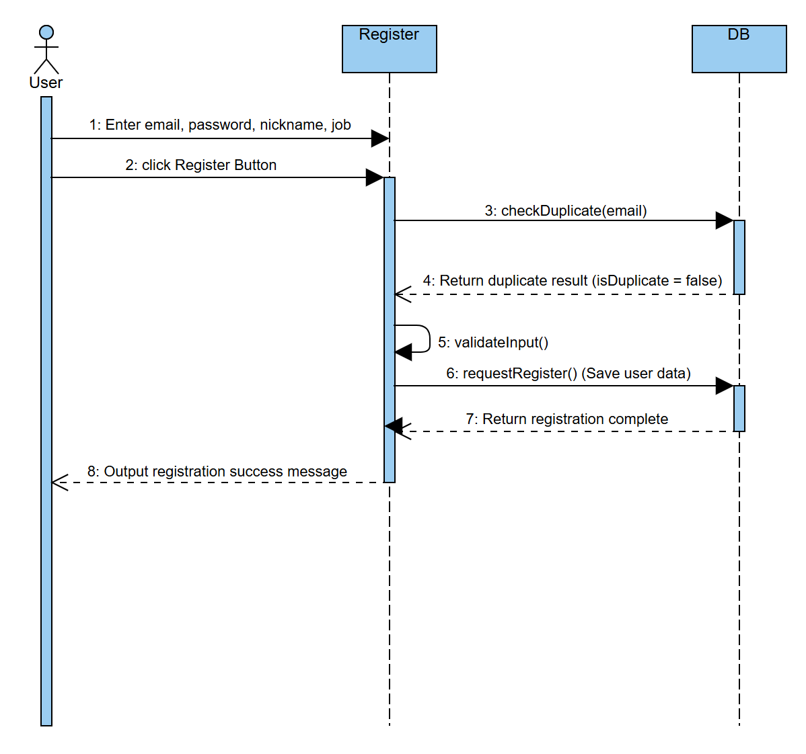
[그림2 - Register Sequence Diagram]  
새로운 사용자가 서비스를 이용하기 위해 회원가입 메뉴에서 이메일, 비밀번호, 닉네임, 직업(전공) 등의 계정 정보를 입력한 후 가입을 요청하는 단계이다. 시스템은 데이터의 유효성과 중복 여부를 꼼꼼하게 검사한 뒤, 이상이 없으면 정보를 DB에 안전하게 저장하고 가입 완료 메시지와 함께 로그인 화면으로 사용자를 이동시킨다.

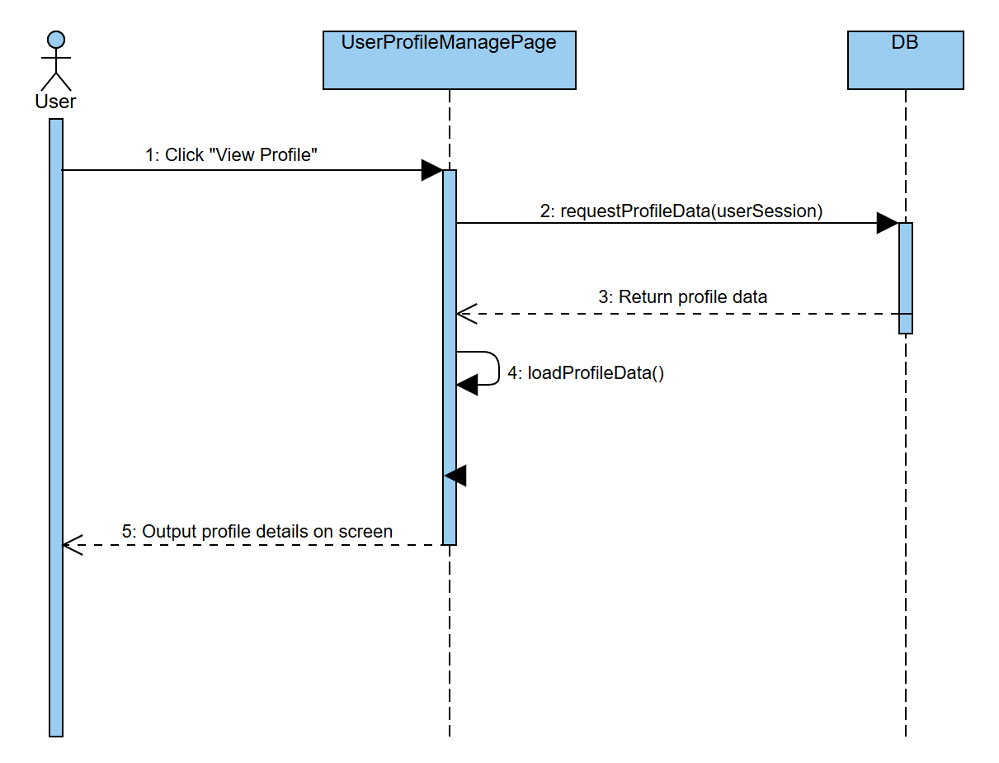
[그림3 - VeiwMyProfile Sequence Daigram]    
로그인된 고객이 자신의 개인정보를 확인하기 위해 마이페이지나 프로필 아이콘을 클릭하는 유스케이스이다. 시스템은 데이터베이스에 접근하여 해당 사용자의 닉네임, 직업군, 누적 총 지출액 데이터를 신속하게 로드한 뒤 프로필 화면에 시각적으로 출력한다.

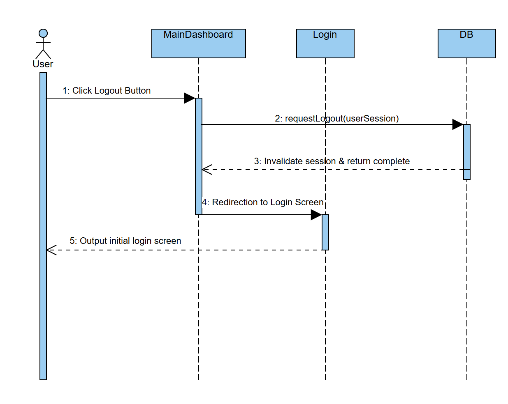  
[그림4- Logout Sequence Daigram]  
사용자가 서비스를 안전하게 종료하기 위해 설정 메뉴에서 로그아웃 버튼을 클릭하는 과정이다. 요청을 받은 시스템은 현재 로그인 상태를 유지하던 세션 정보와 보안 토큰을 서버 및 클라이언트 측에서 즉시 파기한다. 이후 사용자를 초기 로그인 화면으로 안전하게 리다이렉트 시킨다

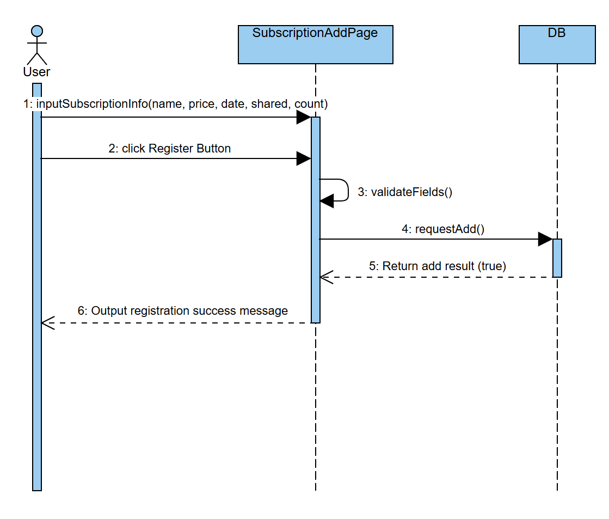
[그림5- Register Subscription Sequence Daigram]  
이용 중인 구독 서비스의 명칭, 금액, 결제일, 카테고리를 새롭게 등록하여 고정 지출을 관리하는 기능이다. 사용자가 입력 폼에 정보를 기입하고 저장 버튼을 누르면 시스템은 데이터 유효성 검사를 거쳐 DB에 최종 반영 후 목록에 노출한다.

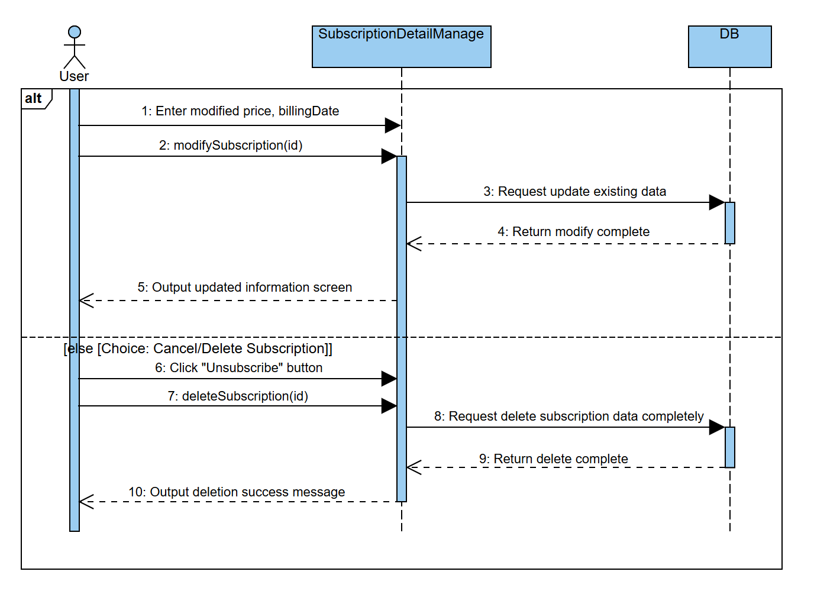
[그림6- Modify/Cancel Subscription Sequence Daigram]  
이미 등록되어 있는 구독 항목의 이용 금액 변동이나 해지 상태 등의 변경 사항을 반영하여 데이터를 최신화하는 유스케이스이다. 사용자가 목록에서 수정할 항목을 골라 정보를 고치거나 '해지 완료'로 상태를 변경한 뒤 수정을 요청하면, 시스템은 이를 검증하여 DB를 업데이트한다. 만약 가동 중 네트워크 연결이 끊어지는 예외를 만나면, 현재 오프라인 상태임을 알리고 나중에 다시 시도하도록 안내한다.

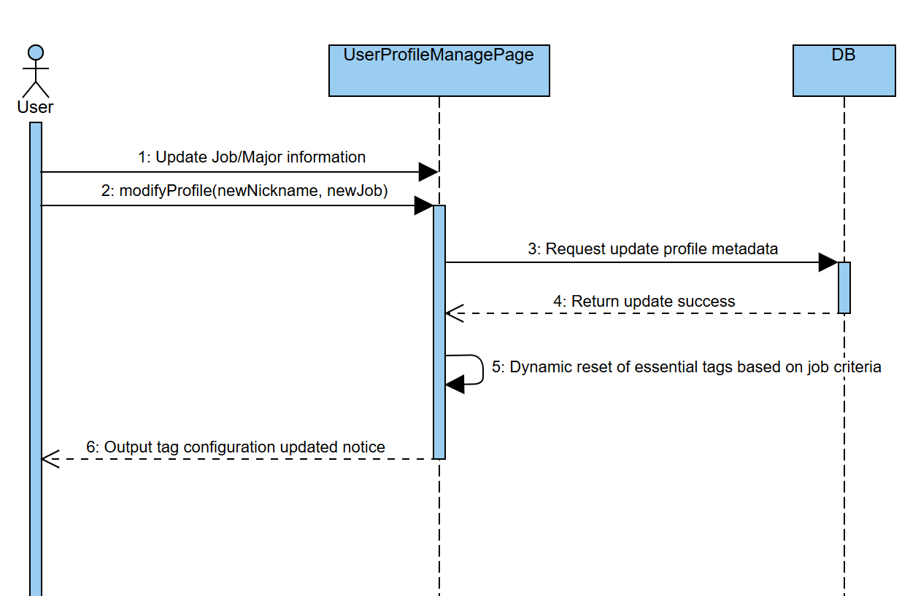
[그림7 - Set Essential Tag Sequence Diagram]  
사용자가 특정 구독 항목의 상세 설정에서 '필수 구독' 스위치를 켜서 고정 지출 감축 대상에서 제외하도록 설정하는 기능이다. 스위치가 활성화되면 시스템은 해당 데이터를 지출 최적화(다이어트) 시뮬레이션의 계산 제외 대상으로 즉시 분류하고, DB 저장 시 'isEssential' 플래그를 True로 기록한다.

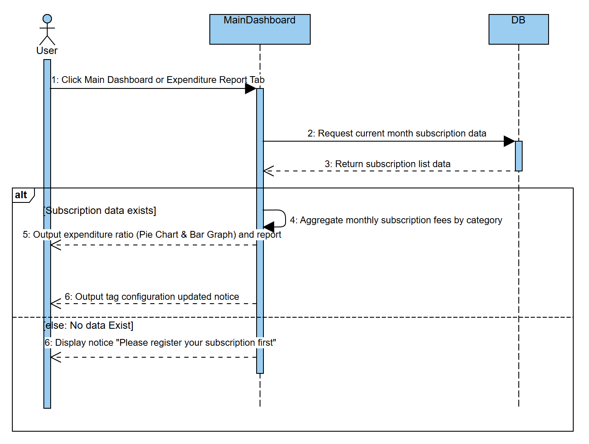
[그림8 - Refer Present Sequence Diagram]  
사용자가 메인 대시보드나 지출 보고서 탭을 클릭하여 당월의 지출 비중과 합계를 직관적으로 확인하는 리포트 기능이다. 시스템은 사용자가 등록한 당월 구독료 데이터를 가져와 카테고리별로 정밀하게 집계한 뒤, 이를 원형 차트(Pie Chart)와 바 그래프 형태로 화면에 시각화한다. 만약 등록된 구독 데이터가 하나도 없는 예외 상황에는, 차트 대신 "구독을 먼저 등록해 주세요"라는 안내 문구를 출력한다.

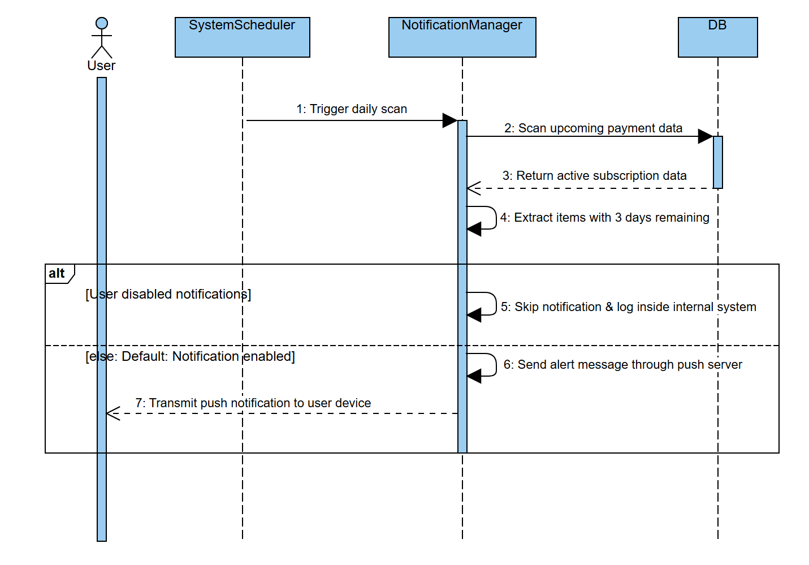
[그림9 - Inform Payment Sequence Diagram]  
시스템 스케줄러가 매일 자정 자동으로 백그라운드에서 결제 예정 데이터를 스캔하여 가동하는 푸시 알림 기능이다. 스케줄러는 등록된 구독 항목 중 결제일이 정확히 3일 남은 항목들을 정밀하게 추출한 뒤, 푸시 서버를 통해 해당 사용자에게 안내 메시지를 전송한다. 다만, 사용자가 기기나 앱 내에서 알림 설정을 사전에 꺼둔 예외 상황이라면 메시지 전송을 건너뛰고 내부 시스템 로그에만 기록을 남긴다.

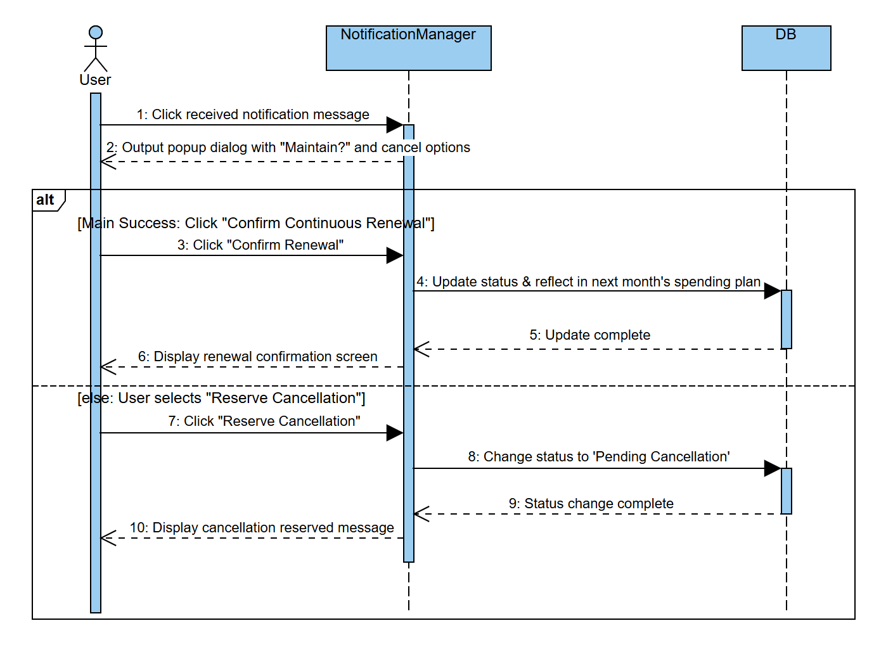
[그림10 - Confirm Renewal Sequence Diagram]  
결제 예정 알림을 받은 사용자가 해당 구독 서비스를 다음 달에도 계속 유지할지 여부를 선택하여 시스템에 확정하는 단계를 다룬다. 사용자가 알림을 클릭하면 팝업 창을 통해 유지 확정과 해지 옵션이 제공되며, 유지 확정 시 다음 달 지출 계획에 정식 반영된다. 만약 사용자가 '해지 예약'을 선택하는 분기로 진입하면, 시스템은 구독 상태를 '해지 예정'으로 변경하고 향후 다이어트 시뮬레이션 연산에 곧바로 반영한다.

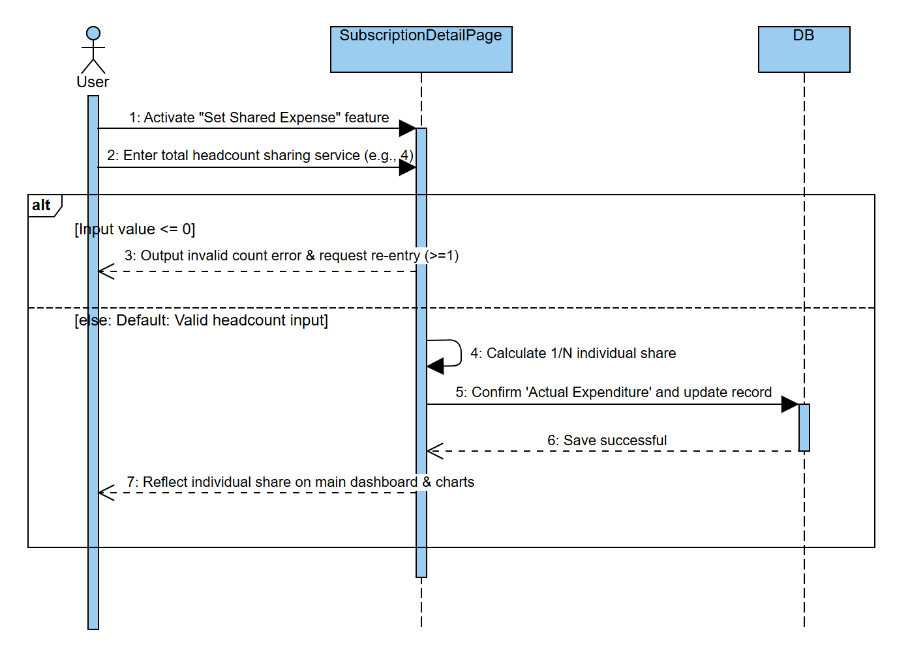
[그림11 - Set Shared Expense (Create Party) Sequence Diagram]  
넷플릭스 등의 공유형 요금제를 사용하는 경우, 실제 분담 인원을 설정하여 개인이 부담하는 실질 지출액을 산출하는 유스케이스이다. 사용자가 본인을 포함한 총 공유 인원수(예: 4명)를 입력하면 시스템은 전체 요금에서 인원수를 나누어 1인당 분담금을 자동 계산한다. 이 금액은 실질 지출액으로 확정되어 대시보드 통계에 반영되며, 만약 인원수에 0명이나 음수를 입력하는 오류가 발생하면 재입력을 요구한다.

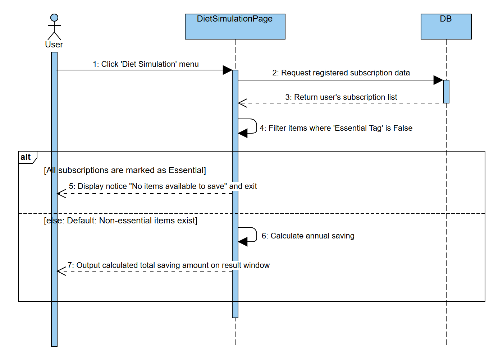
[그림12 - Diet Simulation Sequence Diagram]  
불필요한 지출을 줄이기 위해 '필수(Essential)' 항목을 제외한 선택적 구독들을 해지했을 때 아낄 수 있는 연간 비용을 시뮬레이션하는 기능이다. 시스템은 DB에서 필수 태그가 설정되지 않은 항목들만 정교하게 필터링한 뒤, 해당 월 구독료 합계에 12를 곱하여 연간 총 절약액을 계산해 화면에 출력한다. 만약 사용자가 모든 구독 항목을 필수로 지정해 둔 예외 상황이라면, 절약할 항목이 없다는 안내를 띄우고 종료한다.

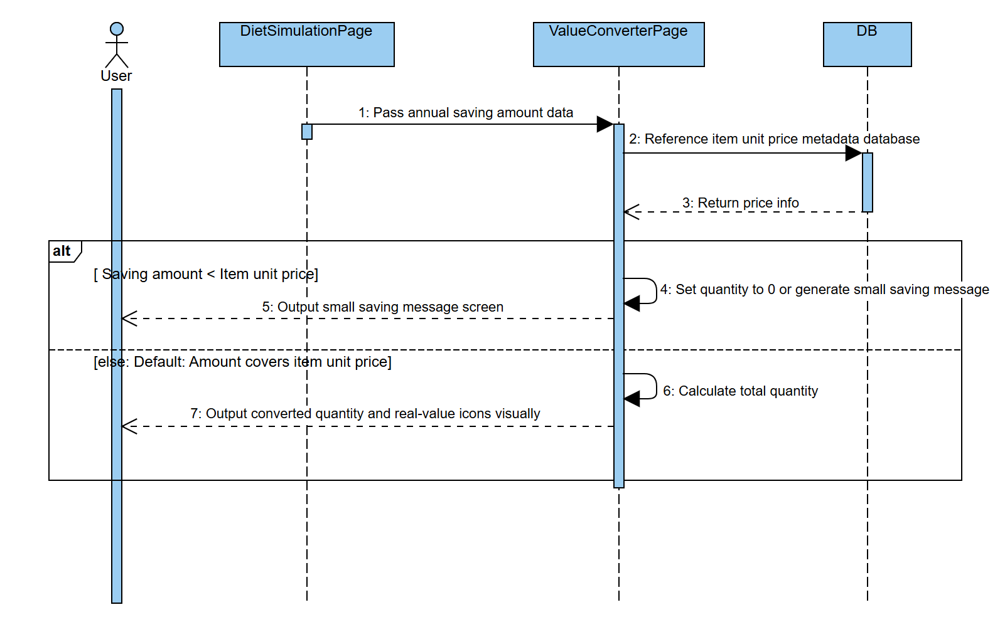
[그림13 - Convert Value Sequence Diagram]  
지출 최적화 시뮬레이션에서 도출된 연간 절약 금액을 치킨이나 커피 같은 직관적인 실물 가치의 개수로 환산하여 체감도를 높여주는 기능이다. 시스템은 절약된 총액을 기반으로 메타 데이터베이스에 정의된 아이템별 단가를 참조하여 나눗셈 연산을 수행한 뒤, 최종 교환 수량을 아이콘과 함께 시각화한다. 단, 아낀 금액이 너무 적어 아이템 단가 한 장에도 미치지 못하는 예외 시에는 개수를 0으로 표현한다.

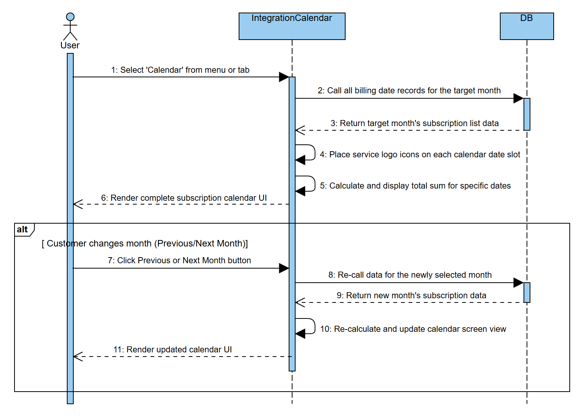
[그림14 - View Subscription Calendar Sequence Diagram]  
월별 달력(캘린더) UI를 통해 날짜별로 어떤 구독 서비스의 결제가 예정되어 있고, 당일 총 지출액이 얼마인지 한눈에 파악하는 기능이다. 시스템은 지정된 월의 결제일 데이터를 호출하여 각 날짜 칸에 해당하는 서비스의 브랜드 로고 아이콘을 배치하고 일별 합산 금액을 출력한다. 사용자가 이전 달이나 다음 달로 달력을 넘기는 확장 시나리오가 발생하면, 시스템은 해당 월의 데이터를 다시 호출해 화면을 갱신한다.

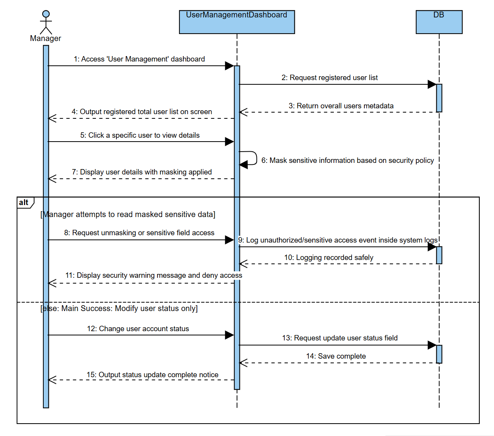
[그림15 - Manage User Sequence Diagram]  
시스템 관리자(Manager)가 전용 대시보드에 접속하여 가입된 전체 회원들의 정보를 안전하게 조회하고 이용 상태를 관리하는 권한 기능이다. 시스템은 회원 리스트를 출력하고 특정 회원 상세 조회 시 보안 정책에 의거해 민감한 개인정보를 자동으로 마스킹 처리하여 화면에 보여준다. 만약 관리자가 마스킹된 데이터에 강제로 접근을 시도하는 예외가 발생하면, 시스템은 경고 메시지와 함께 무단 접근 로그를 엄격히 기록한다.

## 4. State machine diagram
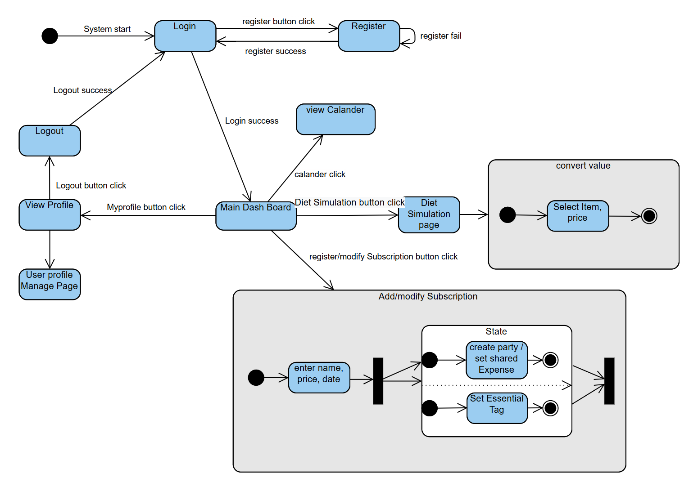

### 1. 시스템 시작 및 계정 관리 단계 (Login & Register)
초기 진입: 시스템이 실행되면 가장 먼저 Login(로그인) 상태로 시작한다.

회원가입 분기: 사용자가 로그인 화면에서 회원가입 버튼(register button click)을 누르면 Register(회원가입) 화면으로 이동한다.

가입 결과 처리: 회원가입이 성공(register success)하면 시스템은 자동으로 다시 Login 화면으로 돌아간다. 반면, 가입에 실패(register fail)할 경우에는 화면이 전환되지 않고 Register 화면에 그대로 남아 사용자의 재입력을 유도한다.

### 2. 메인 대시보드 진입 및 프로필 관리 (Main Board & Profile)
로그인 성공: 로그인 검증이 성공(login success)하면 시스템의 중심 축인 Main Dash Board(메인 대시보드) 화면으로 전환된다.

프로필 및 작성 글 조회: 메인 화면에서 내 프로필 버튼(Myprofile button click)을 누르면 View Profile(프로필 조회) 화면으로 이동한다. 이 화면에서는 사용자의 기본 정보와 함께 해당 사용자가 그동안 작성한 게시글 목록(User profile Manage Page)이 연동되어 화면에 노출된다.

로그아웃 흐름: 사용자가 프로필 화면 등에서 로그아웃 버튼(Logout button click)을 누르면 Logout 상태로 전이되어 활성화된 세션을 완전히 파기하며, 로그아웃이 성공(Logout success)하는 즉시 초기 Login 화면으로 돌아간다.

### 3. 메인 대시보드 내 상시 기능 및 검색 (Main Search)
캘린더 상시 연동: 사용자는 메인 대시보드에서 캘린더 버튼(calander click)을 통해 view Calander(캘린더 조회) 화면으로 진입하여 월별 결제 예정일과 지출 금액을 상시로 확인할 수 있다.

대시보드 검색 기능: 메인 대시보드 내 검색창에 검색 값을 입력하고 검색 버튼(Search button click)을 누르면, 시스템은 데이터를 필터링하여 매칭되는 검색 결과를 화면에 즉시 반환한다.

### 4. 구독 관리 및 다이어트 시뮬레이션 (Subscription & Simulation)
구독 추가 및 수정: 메인 대시보드에서 구독 등록/수정 버튼을 누르면 Add/modify Subscription 화면으로 진입한다. 사용자가 서비스 이름, 금액, 날짜를 입력하면 병렬 처리(Fork)를 통해 create party / set shared Expense(공유 분담 설정) 기능과 Set Essential Tag(필수 태그 설정) 기능을 동시에 혹은 선택적으로 수행하여 저장할 수 있다.

다이어트 시뮬레이션: 메인 대시보드에서 시뮬레이션 버튼을 클릭하면 Diet Simulation page로 이동하며, 이어서 convert value(실물 가치 환산) 서브 상태로 진입하여 비필수 구독 해지 시 절약되는 금액을 기반으로 치킨, 커피 등의 실물 아이템 수량과 가격(Select Item, price)을 연산하여 시각적으로 출력합니다.

## 5. Implementation requirements
본 시스템은 Android Studio 2021.2.1 이상 버전을 사용하여 전체적인 어플리케이션 화면과 기능을 개발하고 빌드하였다. 스마트폰에서 실행할 수 있는 최소 사양은 Android 6.0(API Level 23) 이상이며, 내부 데이터 처리 및 분석 로직을 구현하기 위해 Pandas 2.0 라이브러리를 함께 활용할 예정이다.

이 앱은 안드로이드 네이티브 환경과 Pandas 2.0 라이브러리 버전에 맞춰서 설계되었다. 따라서 아이폰(iOS) 같은 안드로이드가 아닌 다른 운영체제나 환경에서 실행할 경우, 라이브러리 호환성이나 시스템 기능 호출 문제로 인해 특정 기능들이 정상적으로 작동하지 않을 수 있다.

## 6. Glossary

